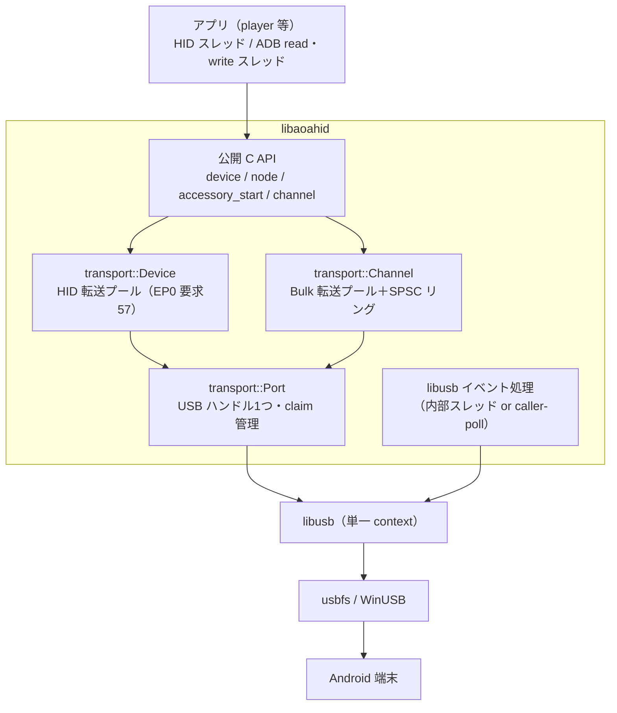
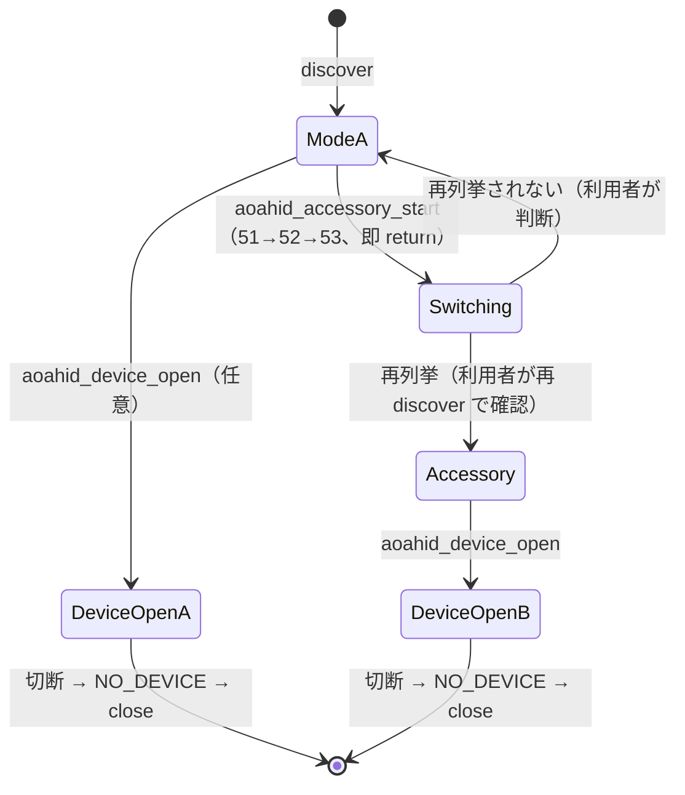

# USB Hub アーキテクチャ設計書（AOA HID / AOA Bulk / ADB の単一ハンドル多重化）

- 対象: `libaoahid`（マスターライブラリ化）、改変 ADB（`libadbhost`）、`aoahid_player`
- 作成日: 2026-09-23（基準: libaoahid v1.0.0 → 実装: v2.0.0）
- ステータス: 2.0.0 で実装（実機検証ゲート未通過。§6 参照）

---

## 0. 結論サマリ

> **2.0.0 で実装した設計**（本節と §1.5〜§4・§6・§7 は実装結果に合わせて改訂済み）。
> 当初案の「Link + Supervisor による自動モード切替・自動再接続・自動再登録」は**不採用**とし、
> 既存 API と同じく**利用者が1手順ずつ明示的に呼ぶ**低レベル設計にした（理由は §1.5）。

| 論点 | 決定 |
|---|---|
| マスターライブラリ | 既存 `libaoahid` を拡張。USB ハンドルの所有権を新設の **Port**（物理デバイス1台＝ハンドル1つ、Context 内の登録簿で管理）に移し、Device と Bulk Channel が参照カウントで共有する |
| モード切替 | `aoahid_accessory_start()` が要求 51→52→53 を送って**即 return**。再列挙の待機・再発見・open は利用者が既存 API（`aoahid_discover` → `aoahid_device_open`）で行う。通常モードへ戻す API は持たない（抜き差しか ADB の `svc usb setFunctions`） |
| ADB / Bulk | `aoahid_channel_open(device, …)` で任意の Bulk インターフェースを同じハンドル上に開く（ADB は `FF/42/01`、アクセサリーのアプリ通信は `FF/FF/00`）。ADB サーバ本体（libadbhost）は将来の段3 |
| 再試行 | **ライブラリは一切再試行しない**（2.0.0 で既存の first-report STALL 再試行も廃止）。STALL された状態は保留され、利用者の次の submit が再送する |
| 切断 | 既存どおり `AOAHID_ERR_NO_DEVICE`。利用者が close → 再 discover → 再 open。自動再接続なし・新エラーコードなし |
| 並行処理 | 追加スレッドなし（既存の任意の内部イベントスレッドのみ）。Bulk 完了は SPSC リング＋待機者がいる時だけの通知、read/write はロック・malloc なし |
| バージョン | 既存動作（再試行）の変更を含むため **2.0.0**（SOVERSION 2） |

---

## 1. 実装戦略とアプローチ (Implementation Strategy)

### 1.1 調査で確定した前提事実

| # | 事実 | 根拠 |
|---|---|---|
| F1 | WinUSB は複数アプリの同時使用をサポートしない。複合デバイスの1インターフェースを別プロセスが使用中だと open が `ERROR_ACCESS_DENIED` になる | libusb Wiki "Windows"（Microsoft WinUSB considerations を引用）、WebUSB issue #185 |
| F2 | Windows の libusb は WinUSB 経由で **真の USB リセットを送れない** | libusb Wiki "Windows" |
| F3 | AOA HID（要求54〜57）は EP0 のみで動作し、新しいインターフェースを必要としない | source.android.com AOA 2.0 |
| F4 | Accessory モードの PID: `0x2D00`（accessory）/ `0x2D01`（accessory＋**adb**）、VID `0x18D1`。要求53後に再列挙される | source.android.com AOA 1.0 / 2.0 |
| F5 | Android `UsbDeviceManager`: `ACCESSORY_REQUEST_TIMEOUT = 10s`（ホストが10秒以内に構成しないと要求取り消し）、USB 切断で accessory を抜けデフォルト機能へ戻る。`accessory,adb` の共存構成あり | AOSP `UsbDeviceManager.java` |
| F6 | 上流 ADB ホスト側 USB は `Connection` 抽象を持ち、libusb バックエンドは `LibUsbDevice`（Open/Close/Read/Write/Reset）＋ hotplug（`register_libusb_transport` 呼び出し）の2箇所に閉じている。Linux/macOS は libusb が既定、Windows は `AdbWinApi` が既定で `ADB_LIBUSB=1` で libusb 経路を選べる | ADB ソース `client/usb_libusb*.cpp`, `client/transport_usb.cpp::is_libusb_enabled`（2025-03 HEAD `1cf2f01`） |
| F7 | ADB の USB を握るのは **adb サーバ**（ポート5037）。`adb` CLI や Android Studio はサーバに TCP で繋ぐクライアントにすぎない。サーバには `adb_set_reject_kill_server()` があり `kill-server` を拒否できる。クライアントとサーバの `ADB_SERVER_VERSION`（現行41）が不一致だとクライアントがサーバを再起動しようとする | ADB ソース `adb.h`, `adb.cpp:1251,1278`, `client/main.cpp:121` |
| F8 | adbd は MS OS 拡張記述子（`WINUSB` 互換ID＋`DeviceInterfaceGUID`）を出す実装を持つが、ベンダーの gadget 設定次第 | ADB ソース `daemon/usb_ffs.cpp` |
| F9 | 現 `libaoahid` は Mode A 専用。`AOAHID_START_ACCESSORY_MODE` 等は ABI の墓標（常に `UNSUPPORTED`）。`aoahid_device_open` が内部で `libusb_open` し、ハンドルを Device が単独所有。discovery も全デバイスを `libusb_open` して要求51を送る | [API.md](API.md), [SOURCE_CONFLICTS.md](SOURCE_CONFLICTS.md) T-07/T-12, `src/transport/*.cpp` |
| F10 | 現 `aoahid_player` は adb CLI を子プロセスで呼び（`wm size`, `getevent`, `devices`）、AOA 接続前に `adb kill-server` で USB を空けている | `src/adb.cpp`, `apps/aoahid_player_gui/app.cpp` |

### 1.2 実装形態の比較と決定

| 案 | 概要 | 評価 |
|---|---|---|
| A. 別プロセスのデーモン＋IPC | USB デーモンが HID/ADB を仲介 | IPC 往復でHIDレイテンシ悪化（優先度1に反する）。プロセス跨ぎの状態同期が複雑。**不採用**（将来のフォールバックとして残す） |
| B. ADB クライアントを改変しアプリにリンク | adb CLI 相当を内蔵 | USB を握るのはサーバなので問題を解決しない（F7）。**不採用** |
| **C. ADB サーバを DLL 化し同一プロセスで起動** | `libadbhost` がアプリ内で 5037 を listen。USB I/O は `libaoahid` の新 API を直接呼ぶ | USB ハンドルがプロセス内で1つに収束し F1 を根本解決。既存 `adb` CLI・Android Studio・scrcpy はそのまま使える。**採用** |

**案Cの副次効果**: `aoahid_player` の `adb_*` ヘルパー（`adb shell wm size`, `getevent` 録画）は **一切変更不要**。CLI クライアントがプロセス内サーバに繋がるだけになる。「接続前に kill-server」という現行の回避策も不要になる。

### 1.3 ADB 改変範囲（最小パッチ方針）

上流を追従し続けられるよう、差し替えは「USB 下層」に限定する。

| 上流ファイル | 改変 |
|---|---|
| `client/usb_libusb_device.cpp` | `libusb_*` 呼び出しを `libaoahid` の Channel API へ置換（Open=`aoahid_channel_open`、Read/Write=`aoahid_channel_read/write`、Reset=非対応） |
| `client/usb_libusb_hotplug.cpp` / `usb_libusb_inhouse_hotplug.cpp` | libusb hotplug を廃止し、アプリが `aoahid_device_open` した端末について `register_libusb_transport` を呼ぶ（検知はアプリの discover 周期） |
| `client/transport_usb.cpp::is_libusb_enabled` | 全 OS で常に true（Windows の `AdbWinApi` 経路を無効化） |
| `client/main.cpp` | `adb_server_main` を「スレッドで起動する関数」に分解。`signal(SIGINT)` 上書き・stderr のログファイル付け替え・`exit()` を除去。`adb_set_reject_kill_server(true)` を常時有効化 |
| 新規 `libadbhost_c_api.cpp` | C ABI（開始・状態取得のみ）。C++ 型は境界を越えない |

改変しない: プロトコル層（`transport.cpp`, `adb.cpp` のサービス群）、認証（RSA鍵は `~/.android` を共用）、fdevent。

ADB ライセンスは Apache-2.0。MIT のアプリと同梱可能だが、NOTICE 同梱と「改変した旨」の明記が必要。

### 1.4 ビルド構成と言語

```
aoahid_player (MSVC / GCC, C++20)  ──C ABI──▶ libaoahid (C++20, C ABI, 共有)
        │                                          ▲
        └──C ABI──▶ libadbhost (C++20, clang/llvm-mingw, 共有) ─C ABI─┘
```

- **言語**: 全て C++20。境界は全て C ABI（`libaoahid` の既存方針 `struct_size`＋`reserved` を踏襲）。
- **Windows のツールチェイン分離**: ADB は GNU 拡張と clang のスレッド注釈に依存し MSVC ではビルド不能。MSYS2 の `mingw-w64-android-tools` が mingw パッチで実績あり。よって `libadbhost.dll` は llvm-mingw でビルドし、**C ABI 以外を公開しない**ことで MSVC 製アプリと CRT/例外 ABI を混在させない。`libaoahid.dll` は双方から同じ1つをロードする（2つロードすると Port 登録簿が二重化し F1 が再発するため、ビルドで単一 DLL を強制）。
- **ADB の依存物**: BoringSSL, protobuf, libbase/liblog/libcutils, brotli/lz4/zstd, openscreen(mDNS)。`nmeum/android-tools` の CMake を基に、mDNS など不要機能は無効化してサイズを削る。
- **管理方法**: `third_party/adb` に上流 submodule、`patches/adb/*.patch` を CMake の `PATCH_COMMAND` で適用。上流更新はパッチ再適用のみで追従。
- **リンク方法**: 共有ライブラリ（動的）。`libaoahid` と `libadbhost` が同じ Port 登録簿を使う必要があり、静的に2箇所へ埋め込むと破綻するため。`libaoahid` 単体の静的ライブラリ配布は継続し、Channel API もそのまま使える（libadbhost と併用する構成だけ共有ライブラリを必須とする）。
- **同梱 adb クライアント**: 同じソースから `adb[.exe]` も生成して同梱。`aoahid_player` の `adb_command` は同梱版を PATH より優先（F7 のバージョン不一致対策）。

### 1.5 採用した公開 API と、当初案からの変更理由

**利用の流れ（全て明示呼び出し）**

```c
aoahid_discover(ctx, 500, &disc);                 // 通常モードの端末
aoahid_accessory_start(ctx, info, &acc_opts);     // 51→52→53 を送って即 return（任意）
/* 端末が切断→ 18D1:2D00/2D01 で再列挙。待つのは利用者 */
aoahid_discover(ctx, 500, &disc2);                // 同じ bus＋port path の 2D0x を選ぶ
aoahid_device_open(ctx, info2, &dev_opts, &dev);  // 既存
aoahid_node_open(dev, spec, &node_opts, &node);   // 既存（54/56）
aoahid_kbd(node, 0x04, 1); aoahid_node_submit(node);            // 既存（57）
aoahid_channel_open(dev, &ch_opts, &ch);          // 任意：ADB 等の Bulk
aoahid_channel_write(ch, p, n, &w, timeout_ms);
aoahid_channel_read(ch, b, cap, &r, timeout_ms);
aoahid_channel_close(ch); aoahid_node_close(node); aoahid_device_close(dev);
```

| 追加 | 既存 API との対応 |
|---|---|
| `aoahid_accessory_start(ctx, info, &aoahid_accessory_options)` | 引数順は `aoahid_device_open` と同じ。options は `struct_size`/`reserved` 規約、文字列は既存 `aoahid_aoa_strings`（メーカー名・モデル名は必須：製品値はライブラリが決めない方針）、0 の `control_timeout_ms` は既存と同じ 500 ms |
| `aoahid_channel_open/close/read/write` | Node と同じく Device の子。close は `aoahid_node_close` と同じ規則（`AOAHID_OK` のみ消費、`CLOSE_PENDING` は保持）、`aoahid_device_close` は子 Channel も消費。`timeout_ms=0` は `aoahid_context_poll` と同じ「待たない」 |
| 構造体 | `aoahid_accessory_options`、`aoahid_channel_options`（新規・既存構造体のサイズは不変） |
| 既存 ABI | 関数・構造体・列挙値・エラーコードは全て不変。`first_report_attempts`/`first_report_backoff_us` は無視される墓標、`AOAHID_START_ACCESSORY_MODE`/`accessory_strings` は従来どおり `UNSUPPORTED` の墓標 |

**当初案から変えた点と理由**

| 当初案 | 採用 | 理由 |
|---|---|---|
| Link（論理デバイス）＋ Supervisor/Notifier スレッド | なし | 利用者が手順を制御したい。スレッド・ロック・状態機械が減り、低遅延・単純化の優先順位に合う |
| 目標モードを設定すると自動で切替・再列挙待ち・再登録 | `aoahid_accessory_start` は送るだけ | 自動化を嫌う要件。待機・再試行の方針は用途ごとに違うため利用者側に置く |
| 切断中は `AOAHID_ERR_SUSPENDED` を返し自動復帰 | 既存どおり `NO_DEVICE` | 既存 API と完全に同じ扱いにする。新エラーコード不要 |
| Link 経由でのみハンドル共有 | Device が Port を持ち Channel/discovery が共有 | Device 中心で既存の流れに寄せる |
| first-report の自動再試行を維持 | 廃止（STALL は保留して利用者が再送） | 全 API で自動再試行なし。STALL は未適用と確認済み（`SOURCE_CONFLICTS.md` T-03） |

#### `libaoahid` 内部

| 箇所 | 変更 |
|---|---|
| `transport::Port`（新規） | ハンドルと claim の唯一の所有者。参照カウント、インターフェース claim の参照カウント、Runtime 登録簿、`start_accessory` |
| `transport::Device` | ハンドルを Port から借用。再試行状態（retry_wait・armed カウンタ・デバイス登録簿）を削除 |
| `transport::Channel`（新規） | Bulk IN/OUT、先読み IN、SPSC リング、明示 ZLP、caller-poll 時は待機中に自分でイベントを回す |
| discovery | 既に開いている端末は Port のハンドル経由で要求51（2本目の open をしない） |

---

## 2. システムアーキテクチャとデータフロー (Architecture & Data Flow)

### 2.1 コンポーネント図



### 2.2 ルーティング

| 論理チャネル | Mode A（通常） | アクセサリー 2D01 | アクセサリー 2D00 |
|---|---|---|---|
| HID 入力 | EP0 要求57 | EP0 要求57 | EP0 要求57 |
| HID 登録 | EP0 要求54/56 | 同左（再列挙後に利用者が node_open し直す） | 同左 |
| モード切替 | `aoahid_accessory_start`（51/52/53） | 送らない | 送らない |
| ADB | Channel `FF/42/01` | Channel `FF/42/01` | 利用不可 |
| アプリ Bulk | 利用不可 | Channel `FF/FF/00` | Channel `FF/FF/00` |

インターフェース番号は固定せず毎回 (class, subclass, protocol) で解決する。

### 2.3 データフロー

- HID：`aoahid_node_submit` → 事前確保スロット → `libusb_submit_transfer`（非同期）→ 完了コールバックで状態更新。再試行なし。
- Bulk IN：open 時に `in_transfers` 本を常時投入 → 完了で SPSC リングへインデックス公開 → `aoahid_channel_read` がバイトストリームとして取り出し、空になった転送を再投入。
- Bulk OUT：`aoahid_channel_write` が空き OUT スロットへコピーして投入 → 完了でスロットを SPSC リングへ返却。満杯なら `timeout_ms` まで待って `TIMEOUT`（背圧）。

---

## 3. 並行処理とスレッドモデル (Concurrency Model)

| スレッド | 所有者 | 仕事 |
|---|---|---|
| アプリの HID スレッド | 利用者 | 状態更新＋submit（既存どおり Context 直列化規約） |
| アプリの Bulk read / write スレッド | 利用者 | internal-thread モードでは Context の他の呼び出しと並行可（同じ Channel の close・Device close・Context 破棄とは並行不可） |
| 内部イベントスレッド（任意・既存） | libaoahid | libusb 完了処理のみ |

- ホットパス（submit・channel read/write・完了コールバック）に mutex・malloc・同期 libusb 呼び出し・外部コールバックはない。HID プールは既存の INTERNAL_THREAD 用短いスピンロックを維持。
- Bulk 完了は「リング公開 → 待機者がいる時だけ通知（その時のみ待機者用 mutex）」。通知漏れは seq_cst の順序で防止（TSan で検証）。
- caller-poll モードでは Channel の待機中にその呼び出し元が `libusb_handle_events` を回す（`submit_blocking` と同じ方式）。

---

## 4. 状態遷移とライフサイクル (State Management)

ライブラリは状態機械を持たない。利用者側の流れ：



- STALL：要求57を端末が拒否＝未適用。状態を保留し、利用者の次の submit で同じ内容を再送。Timeout/cancel/I/O は届いた可能性があるため状態を消費（重複防止）。
- 通常モードへ戻す API はない（USB に「アクセサリーを抜けろ」という要求がないため。抜き差し、または ADB の `svc usb setFunctions`）。

---

## 5. リスク評価と軽減策 (Risk Assessment)

| # | リスク | 影響 | 可能性 | 軽減策 |
|---|---|---|---|---|
| R1 | 完了コールバックから外部コードを呼び、外部が完了待ち API を呼んでデッドロック | 致命 | 高 | ライブラリは外部コールバックを一切追加しない（イベント通知機能なし）。完了処理は状態公開と通知のみ |
| R2 | ADB `Stop()` が read スレッドを join するが、read が Bulk 待機で起きない | ハング | 中 | `aoahid_channel_close`／`aoahid_device_close` が Channel を喪失状態にして全転送を cancel し、待機者を起こす。read は `timeout_ms` 付きで待つ |
| R3 | 大量 ADB 転送（`adb push`）中に HID 遅延が増える | 体感遅延 | 中 | Bulk は HID と別プール、ホットパス無ロック・無 malloc、完了処理 O(1)。ワイヤ上は EP0 が有利（§2.2）。実機の p50/p99 は未計測（TARGET_MATRIX 項目9） |
| R4 | 外部の標準 adb サーバが先に 5037 と USB を掴む | 起動失敗 | 高 | 起動時に 5037 を確認し、外部サーバには `kill-server` を送ってから自サーバを bind。以後 `reject-kill-server` で奪還を拒否。状態をGUIの *adb* ピルに表示 |
| R5 | adb クライアントのバージョン不一致（`ADB_SERVER_VERSION`） | 外部ツールが繋がらない | 中 | 上流追従でバージョンを一致させる。同梱 adb を優先使用。不一致検出時はログで明示 |
| R6 | Windows で ADB IF が WinUSB 以外（例: 一部ベンダー独自ドライバ）にバインドされている | Windows で全機能不可 | 中 | 起動時に IF のドライバ種別を判定し、WinUSB でなければ導入手順（Google USB Driver / libwdi 系インストーラ）を案内。標準 adb の `AdbWinApi` も WinUSB 上で動くので置き換えても既存ツールは壊れない |
| R7 | Windows でアクセサリーモードの端末（2D00/2D01）に WinUSB 互換ドライバが割り当たらない | Windows でアクセサリーモード不可 | 中〜高 | 2D01 は ADB IF の Google USB Driver（WinUSB）経由で開ける可能性。2D00 は INF の導入が必要。実機未検証（TARGET_MATRIX 項目6） |
| R8 | 端末が通常モードで HID（54〜57）を受け付けない | 通常モード HID 不可 | 端末依存 | `SOURCE_CONFLICTS.md` T-07。利用者が `aoahid_accessory_start` でアクセサリーモードに切り替えて開く（自動フォールバックはしない） |
| R9 | accessory モードでシリアル番号が変わる端末 | 同じ端末かの判断を誤る | 低〜中 | ライブラリは同定しない。利用者は bus＋port path で照合（T-13、`verify_accessory.c`） |
| R10 | discovery の要求51が accessory 状態をリセット（T-12） | アクセサリーモード崩壊 | 中 | 開いている端末は既存ハンドル経由で probe。アクセサリーモード端末への要求51の影響は実機未検証（TARGET_MATRIX 項目4） |
| R11 | ADB のグローバル状態・`exit()`・`atexit`・`LOG(FATAL)` がホストプロセスを落とす | アプリ異常終了 | 中 | パッチで `exit` 系を除去、`LOG(FATAL)` はプロセス終了を許容範囲として監視。ADB サーバは**プロセス内で1回だけ起動・再起動しない**（停止はプロセス終了時）。将来は案A（別プロセス）へ切替可能なよう C ABI 境界を IPC 化しやすい形に保つ |
| R12 | Windows スリープ復帰で全エンドポイントが閉じる | 一時切断 | 中 | 既存どおり `NO_DEVICE` を返し、利用者が close → 再 open |
| R13 | MSVC アプリと mingw 製 ADB DLL の混在 | CRT 不整合 | 中 | C ABI のみ公開、メモリの確保と解放を同じモジュール内に閉じる、例外を境界で捕捉 |
| R14 | 到着・消失の検知 | 再接続の遅れ | 中 | ライブラリは検知しない。利用者が自分の周期で `aoahid_discover` する（アクセサリー切替後の待ち方も利用者が決める） |
| R15 | Linux で他プロセス（標準 adb、fwupd 等）が同じデバイスを開く | 競合 | 低 | Linux usbfs はインターフェース claim が排他。claim 失敗時は保持プロセスを特定するヒントを表示 |

### OS 差異のまとめ

| 項目 | Linux (usbfs) | Windows (WinUSB) |
|---|---|---|
| 複数プロセス同時アクセス | IF 単位の claim が排他（別 IF は可） | デバイス単位で実質排他（F1） |
| EP0 の経路 | デバイスノード経由 | WinUSB がバインドされたいずれかの IF ハンドル経由 |
| USB リセット | 可 | 不可（F2） |
| ZLP | 転送フラグ | パイプポリシー or 明示送信 |
| hotplug | libusb ネイティブ | OS 通知＋列挙補完 |
| 権限 | udev ルール（既存 `51-aoahid.rules` に 18D1:2D00-2D05 を追加） | ドライバ導入（管理者権限が一度必要） |

---

## 6. 実機検証ゲート

実機で確認すべき項目は [TARGET_MATRIX.md](TARGET_MATRIX.md)「Accessory mode and Bulk Channel hardware status」に10項目として記録済み（全て `[unverified on hardware]`）。

## 7. ロードマップ

1. ✅ Port 抽出（ハンドル所有の一元化）— 2.0.0
2. ✅ 自動再試行の全廃、`aoahid_accessory_start`、Device 上の Bulk Channel — 2.0.0
3. libadbhost：上流 ADB サーバを Channel 上で動かす（§1.3〜§1.4 の計画。範囲外）
4. aoahid_player 統合：`find_package(aoahid 2.0)`、STALL 時の再送、アクセサリーモード手順の組み込み
5. 実機検証（§6）と、ADB 大量転送中の HID 遅延の計測

## 参考資料

- [libusb Wiki: Windows](https://github.com/libusb/libusb/wiki/Windows)
- [WebUSB issue #185: fail to open device with multiple interface usb device on windows](https://github.com/WICG/webusb/issues/185)
- [WinUSB (Wikipedia)](https://en.wikipedia.org/wiki/WinUSB)
- [libusb PR #1406: windows hotplug implementation](https://github.com/libusb/libusb/pull/1406)
- [Android Open Accessory Protocol 1.0](https://source.android.com/docs/core/interaction/accessories/aoa)
- [Android Open Accessory Protocol 2.0](https://source.android.com/docs/core/interaction/accessories/aoa2)
- [AOSP UsbDeviceManager.java](https://android.googlesource.com/platform/frameworks/base/+/master/services/usb/java/com/android/server/usb/UsbDeviceManager.java)
- [AOSP packages/modules/adb](https://android.googlesource.com/platform/packages/modules/adb)（調査時 HEAD `1cf2f017`）
- [nmeum/android-tools](https://github.com/nmeum/android-tools) / [MSYS2 mingw-w64-android-tools](https://github.com/msys2/MINGW-packages/tree/master/mingw-w64-android-tools)
- [API.md](API.md), [SOURCE_CONFLICTS.md](SOURCE_CONFLICTS.md)（T-07, T-12）, `PORTING.md`, `LATENCY.md`
