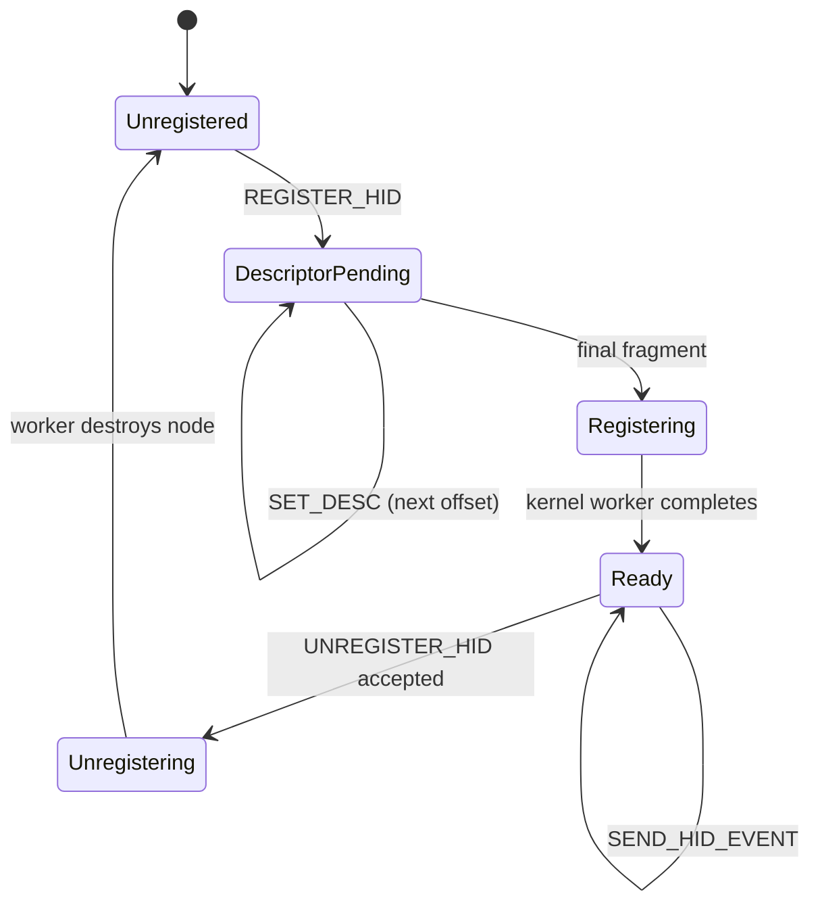

# Android Open Accessory 2.0 HID: Complete Implementation Guide

**Audience:** Library authors and users implementing AOA 2.0 HID with Android operating as the USB device and a PC, microcontroller, or embedded system operating as the USB host/accessory  
**Verification date:** August 27, 2026  
**Technical baseline:** AOA 1.0/2.0, the specified AOSP kernel sources, Android Input, USB HID 1.11, HID Usage Tables 1.7, libusb 1.0, and Microsoft HID documentation

> In this document, “complete” means that every Usage Page defined by HID Usage Tables 1.7 and every major device class relevant to stock Android is classified without omission. AOA can carry any valid HID Report Descriptor and Input report, but Android does not recognize every Usage. This document does not claim that Vendor Defined Usages, future Usages, or every syntactically valid HID device automatically become available to ordinary Android applications.

---

## 0. Executive Conclusions

1. **AOA HID is an AOA 2.0 feature.** The currently defined values returned by `ACCESSORY_GET_PROTOCOL` are 1 and 2, and HID requires version 2. A library may accept `>= 2` only as an explicitly documented forward-compatibility policy.
2. **AOA HID requests 54 through 57 operate entirely as device-recipient EP0 control transfers.** `ACCESSORY_START`, re-enumeration as 18D1:2D0x, and creation of an Accessory bulk interface are not protocol requirements when HID is the only required function.
3. **AOA HID in the specified `f_accessory.c` implementation is effectively Input-only.** Input reports can travel from the accessory to Android. Output reports, GET/SET Feature data, keyboard LEDs, rumble, haptics, and other Android-to-accessory HID traffic cannot.
4. **The ability to transport an arbitrary HID descriptor is not the same as Android support for an arbitrary HID device.** The most practical stock-Android targets are standard keyboards, mice, supported Consumer Control keys, gamepads/joysticks, touchscreens, touchpads, and pens/styluses.
5. **In the specified implementation, an AOA-created logical HID uses `BUS_USB`, vendor/product=`HID_ANY_ID`, and has no unique name.** It does not inherit 18D1:2D0x as its HID VID/PID. Designs that depend on VID/PID-specific drivers, quirks, IDC files, or `.kl` files are not portable.
6. **Sensors, FIDO, Braille displays, LEDs, Haptics, PID/force feedback, lighting, display control, and similar devices do not become fully functional merely because their Usages are present in the descriptor.** They require bidirectional reports, a dedicated kernel/HAL path, or an interface that is not exposed to ordinary applications.
7. **Android platform API version 37.1 adds permission/app-op-controlled `HidManager` and `HidDevice` APIs, but it does not make AOA bidirectional.** These APIs add HID-node enumeration, descriptor access, and Feature/Output operations. They do not expose a public continuous raw Input-report stream, and the specified AOA driver still has no Output transport and performs no real Feature transfer.
8. **Differences among Android releases and vendor kernels require device testing.** On Android 16 and later, and on devices exposing platform API version 37.1 or later, verify the AOA gadget implementation, HID-node exposure, and framework classification with `getevent`, `dumpsys input`, and a test application.

### 0.1 Evidence Labels

| Label | Meaning |
|---|---|
| **[AOA specification]** | A requirement or behavior explicitly documented by the official Android AOA 1.0/2.0 documentation |
| **[Specified AOSP implementation]** | A behavior verified in the user-specified Pixel 2 / Android 8-era `f_accessory.c` or specified `hid-multitouch.c` |
| **[Current AOSP/Linux]** | A behavior verified in current AOSP, GKI, or Linux HID/Input sources |
| **[Android specification]** | A behavior documented by official Android Input documentation or public Android APIs |
| **[HID specification]** | A requirement from USB-IF HID 1.11 or HID Usage Tables 1.7 |
| **[Windows requirement]** | A Microsoft Windows compatibility or certification requirement; it is not automatically an Android requirement |
| **[Guide policy]** | A design policy recommended for robustness across Android releases; it is not presented as a protocol limit |

---

## 1. Fact Check and Corrections to the Original Document

| Original claim | Assessment | Corrected statement |
|---|---|---|
| AOA HID always requires switching to Accessory mode | **Incorrect** | Requests 54–57 are device-recipient EP0 requests and can be used in the normal USB mode. Use `START` only when the selected configuration requires an Accessory interface or another Accessory-mode function. |
| 18D1:2D00–2D05 are the VID/PID values of the AOA logical HID | **Incorrect** | These identify the physical USB device and function combination after mode switching. In the specified implementation, the logical HID uses vendor/product=`HID_ANY_ID`. |
| AOA HID is always `MT_CLS_DEFAULT` and cannot become `MT_CLS_WIN_8` | **Incorrect** | Linux `hid-core` can detect the Windows 8 vendor Feature pattern in a descriptor and change the group. AOA cannot return the required Feature data, so the portable descriptor should not depend on that mode. |
| In Range and Touch Valid, historically called Confidence by Linux and Microsoft, are always ineffective on Android | **Overgeneralized** | Their effects depend on the kernel class, quirks, device implementation, and pen/touch path. Do not rely on them for contact validity or palm classification in the specified generic MT default class. |
| Adding a Button Page always prevents touchscreen classification | **Release-dependent** | The specified Android 8 path gives DIRECT priority and can retain screen classification. Current AOSP can also add the TOUCHPAD class from MT X/Y plus POINTER-like capabilities and select the touchpad mapper. Place unnecessary buttons in a separate AOA HID ID. |
| Contact Count 0 is prohibited by the HID specification | **Incorrect** | Zero is not universally prohibited and can participate in Linux MT multi-packet continuation behavior. For reliable lift, explicitly report the same Contact ID and final X/Y with `Tip Switch=0`. |
| A HID Logical Maximum is always negative when its most significant bit is set | **Incorrect** | A field is unsigned when both Logical Minimum and Logical Maximum are nonnegative. With minimum 0, `0x26 FF FF` is interpreted as 65535; a four-byte item is not always required. |
| Android limits every AOA report to 1024 bytes | **Incorrect** | AOA defines no single universal limit. One report must fit in one control transfer and is constrained by the implementation's EP0 buffer. A checked tree uses 4096 bytes. A 1024-byte limit is only a conservative library policy if adopted. |
| Linux always limits the descriptor to 4096 bytes | **Incorrect** | The AOA wire length comes from 16-bit `wIndex` and is 1–65535. `HID_MAX_DESCRIPTOR_SIZE=4096` applies to particular APIs/transports and is not a universal limit of the specified AOA path. |
| `HID_MAX_FIELDS=256` limits the number of Usages in the entire descriptor | **Incorrect** | It is a Linux implementation limit on fields in one `struct hid_report`, meaning one report type plus Report ID. |
| Android always requires both Width and Height | **Incorrect** | Major size can be used alone, and some paths synthesize minor size from major size. Both are recommended for better shape and orientation accuracy. |
| Android never uses touch size for palm rejection | **Incorrect** | Android 13 and later include touch processing that can use size and resolution for palm rejection. The result remains device- and configuration-dependent and must be tested for a generic AOA device. |
| A Feature item is useful only as a container for Logical Maximum | **Incorrect** | A Feature definition can have descriptor-level meaning, but the specified AOA transport does not exchange Feature values. Classes that require a Feature response will not work. Contact Max helps only where the specified MT driver falls back to the field's Logical Maximum. |
| libusb requires one Context per thread | **Incorrect** | libusb officially supports sharing a Context. One shared Context with a coordinated event pump or one event thread is generally simpler. |
| After canceling, it is safe to leak only the pool after 500 ms and close the handle | **Incorrect** | Callback state, buffers, `user_data`, objects, handles, and the Context must remain alive through the terminal callback. Drain every callback or retain the entire incomplete state. |
| A touch-only API is sufficient to call a library an AOA HID library | **Incomplete** | Separate transport from profiles and support keyboard, mouse, consumer control, gamepad, touch, touchpad, pen, and validated raw descriptors. |

---

# Part I. The AOA 2.0 HID Protocol

## 2. AOA 1.0 and AOA 2.0

Primary sources: [AOA 1.0](https://source.android.com/docs/core/interaction/accessories/aoa) and [AOA 2.0](https://source.android.com/docs/core/interaction/accessories/aoa2)

- **[AOA specification]** AOA 1.0 defines the Accessory protocol, identification strings, and the Accessory-mode transition. It does not define AOA HID.
- **[AOA specification]** AOA 2.0 adds HID and audio mode. HID is a proxy for standard HID events; the AOA layer does not assume an event type or payload meaning.
- **[Guide policy]** Require `GET_PROTOCOL` to return exactly two bytes, decode them as a little-endian `uint16_t`, and use HID when the value is 2. An API designed for forward compatibility may accept `>= 2`, but should log that the currently defined version is 2.

Classify `GET_PROTOCOL` results during discovery as follows.

| Result | Classification |
|---|---|
| `LIBUSB_ERROR_PIPE` / STALL | Request unsupported; an ordinary negative probe result |
| Exactly two bytes with value 0 | AOA unsupported |
| Short transfer | Malformed or unsupported; exclude the candidate |
| Value 1 | AOA 1.0; HID unavailable |
| Value 2 | AOA 2.0; HID available |
| Value greater than 2 | Accept only under an explicit forward-compatibility policy |

Do not classify a STALL from a non-AOA device as a fatal I/O error or a descriptor error.

## 3. Control Request Reference

All requests use the device recipient. Only `GET_PROTOCOL` is IN; every other request is OUT.

| `bRequest` | Name | `bmRequestType` | `wValue` | `wIndex` | Data stage |
|---:|---|---:|---|---|---|
| 51 | `ACCESSORY_GET_PROTOCOL` | `0xC0` | 0 | 0 | IN: two-byte little-endian version |
| 52 | `ACCESSORY_SEND_STRING` | `0x40` | 0 | string ID 0–5 | OUT: NUL-terminated UTF-8, at most 256 bytes including NUL |
| 53 | `ACCESSORY_START` | `0x40` | 0 | 0 | none |
| 54 | `ACCESSORY_REGISTER_HID` | `0x40` | accessory-selected HID ID | total descriptor byte length | none |
| 55 | `ACCESSORY_UNREGISTER_HID` | `0x40` | HID ID | 0 | none |
| 56 | `ACCESSORY_SET_HID_REPORT_DESC` | `0x40` | HID ID | descriptor byte offset | OUT: descriptor fragment |
| 57 | `ACCESSORY_SEND_HID_EVENT` | `0x40` | HID ID | 0 | OUT: one Input report |
| 58 | `ACCESSORY_SET_AUDIO_MODE` | `0x40` | 0 or 1 | 0 | none; audio mode was deprecated in Android 8.0 |

String IDs are manufacturer=0, model=1, description=2, version=3, URI=4, and serial=5. **[AOA specification]** If manufacturer and model are not sent, Android does not search for a matching application and does not expose an Accessory bulk interface.

This result is not identical in every Android implementation. **[Specified AOSP implementation]** The specified Android 8-era `f_accessory.c` clears the strings on every `GET_PROTOCOL` and then populates both manufacturer and model with `"Android"`. A specific 2024 `kernel/common` commit clears the strings without supplying those defaults. Omitting strings is therefore a valid app-less design under the specification, but the actual application search, association UI, and Accessory-interface behavior must be verified for each release and vendor.

### 3.1 AOA HID IDs and HID Report IDs Are Different

| Identifier | Range or location | Purpose |
|---|---|---|
| **AOA HID ID** | Request `wValue`; a `uint16_t` on the wire | Selects a logical HID registered inside the Android kernel. It must be unique while registered. |
| **HID Report ID** | A descriptor `Report ID` item and the first report byte | Selects among report layouts within one logical HID. The declared range is 1–255. |

- If a descriptor uses a `Report ID` item anywhere, every Input, Output, and Feature data report for that logical HID begins with a one-byte Report ID. Declare the ID before the first Input, Output, or Feature Main item and do not mix ID-prefixed and unprefixed layouts.
- If the logical HID never uses a Report ID item, do not prepend an ID value of zero.
- Report ID 0 cannot be explicitly declared. Valid declared values are 1–255.

## 4. Two Valid Startup Modes

### 4.1 Mode A: HID in the Normal USB Mode

1. Open the target Android device by its OEM VID/PID.
2. Confirm AOA 2.0 with `GET_PROTOCOL`.
3. Send `REGISTER_HID`, followed by all descriptor fragments.
4. Send Input reports with `SEND_HID_EVENT`.

**Advantage:** There is no re-enumeration, and the existing MTP/ADB configuration may remain unchanged.  
**Caution:** The host OS still needs a driver and permission capable of issuing device-recipient EP0 requests to the OEM VID/PID. Verify that the target device and vendor kernel handle AOA requests in normal mode. A specific 2024 `kernel/common` GKI-oriented commit added a special path for processing AOA requests before the Accessory function is configured, but the commit explicitly rejects general adoption in Android mainline and future branches because of reference-counting concerns. Do not generalize it to all current Android devices.

### 4.2 Mode B: Switch to Accessory Mode

1. Issue `GET_PROTOCOL`.
2. When an Accessory bulk interface is required, send the required strings with `SEND_STRING`. For an audio-only/app-less configuration, the AOA 2.0 specification permits omission of manufacturer and model, subject to the implementation difference described above.
3. When audio is requested, issue `SET_AUDIO_MODE` with request 58 and value 1 **before** `START`. AOA audio has been deprecated since Android 8.0.
4. Issue `START`.
5. Discard the old handle, locate the re-enumerated 18D1:2D00–2D05 device, and open it again.
6. On the new handle, perform `REGISTER_HID`, descriptor transfer, and event transmission.

In Mode B, send manufacturer and model when an Accessory bulk interface is needed. As a defensive policy, also send version even though it is formally optional. The current AOA 1.0 documentation warns that, on Android 10 and earlier, omitting version can cause a system-process exception and device restart when a compatible application contains a version-only intent filter. Sending manufacturer/model may trigger application discovery and association UI, so document this as part of the deployment user experience.

| PID | Function configuration |
|---:|---|
| 2D00 | accessory |
| 2D01 | accessory + adb |
| 2D02 | audio |
| 2D03 | audio + adb |
| 2D04 | accessory + audio |
| 2D05 | accessory + audio + adb |

**Important:** This table describes the physical USB device PID, not the logical HID PID. PID 2D00 is a single function; the other PIDs may be composite or may contain no Accessory interface. Selecting strings plus `START` to obtain an Accessory interface usable with WinUSB is a practical Windows configuration, not a prerequisite for HID requests themselves.

**Use Mode A for app-less HID-only operation.** The PID table defines no HID-only configuration, and the specification does not guarantee re-enumeration as 2D0x after `START` with manufacturer/model omitted. Only an app-less configuration with audio enabled is a candidate for audio PIDs 2D02/2D03. Do not switch modes solely for HID-only operation.

## 5. HID Registration State Machine



### 5.1 Conditions Established by the Specified `f_accessory.c`

Source: [specified `f_accessory.c`](https://android.googlesource.com/kernel/msm/+/android-msm-wahoo-4.4-oreo-dr1/drivers/usb/gadget/function/f_accessory.c)

- A descriptor length of zero is rejected. Because `wIndex` is 16-bit, the on-wire descriptor length is 1–65535 bytes.
- A descriptor fragment's `wIndex` must **exactly equal** the number of bytes received so far. Duplicates, rewind, gaps, and reordering are rejected.
- The official specification does not fix a fragment size. Split a descriptor larger than the EP0 maximum packet size into ordered fragments. A 64-byte fragment is a conservative implementation policy, not a protocol constant.
- When the same HID ID is registered again, the specified implementation replaces the old device. The specification requires unique IDs, however. Do not expose replacement as a portable API; explicitly unregister first.
- After the final fragment's control transfer completes, a kernel worker registers the HID asynchronously. If the first event arrives before that worker, the request can STALL.
- Successful completion of the `UNREGISTER_HID` control transfer means that the request was accepted and event routing stopped. It does not mean the Android input node has already been destroyed. The object moves to `dead_hid_list`, and a worker later calls `hid_destroy_device()`. There is no completion notification.
- If the same HID ID is immediately re-registered, the worker ordering can register the new device before destroying the old one, temporarily exposing both nodes. A portable library should allocate a fresh ID during the same connection or use a quiescence policy that has been validated on the target kernel.
- **[Guide policy]** Only the first event may receive a small bounded retry with backoff for `LIBUSB_ERROR_PIPE` or transfer STALL. Never retry forever. Emit diagnostics when device removal cannot be distinguished from descriptor-parse failure.
- A successful USB descriptor transfer does not prove that `hid_parse_report()` and device registration succeeded. AOA has no ready callback.

## 6. AOA-Specific Limits and Values That Are Not Protocol Limits

| Item | Specification or implementation fact | Library policy |
|---|---|---|
| AOA HID ID | A `uint16_t` on the wire | Zero is representable, but allocate unique IDs in the diagnostic-friendly range 1–65535. |
| Descriptor length | The specified AOA registration wire field supports 1–65535. Linux UAPI and some transports define `HID_MAX_DESCRIPTOR_SIZE=4096`, but a universal 4096-byte check cannot be inferred from the specified direct `hid_parse_report()` path. | Use 4096 as the default portability policy, permit a target override, and never label it as the AOA wire limit. |
| Fragment length | AOA defines no fixed value. | Default to 64 bytes, configurable according to device EP0 and the OS backend. |
| Input-report length | AOA defines no single limit; one report is sent in one control transfer. The known libusb Linux/Windows control-buffer limit is 4096 bytes including the eight-byte setup packet, leaving at most 4088 payload bytes. | A default of 1024 is a conservative policy. An override must be no greater than `min(AOA wLength, Android EP0 data buffer, libusb/OS limit - 8)`. |
| Report fragmentation | The event request has no offset or sequence field. | **Never split one HID report across multiple requests.** |
| HID field count | Linux `HID_MAX_FIELDS` applies per report type and Report ID. | Do not present it as a descriptor-wide Usage limit. |
| Android pointer count | A `MotionEvent` has a practical limit of 16 pointers. | Define 1–16 contacts as the portable touchscreen-profile range. This is separate from kernel slot limits. |

An examined Android composite tree uses a 4096-byte EP0 buffer, but that value must not be assumed for every Android kernel. The libusb value of 4096 includes the setup packet, so the same number refers to a different payload boundary. Normal profile reports are usually tens to hundreds of bytes; require measured overrides on both the host backend and target kernel before enabling large raw reports.

---

# Part II. Android Internal Behavior

## 7. The Logical HID Created by the Specified `f_accessory.c`

### 7.1 Report Direction

The `ACCESSORY_SEND_HID_EVENT` completion path injects a report as follows:

```c
hid_report_raw_event(hid->hid, HID_INPUT_REPORT,
                     req->buf, req->actual, 1);
```

The practical AOA data path is therefore an accessory-to-Android **Input report** path.

| HID report or function | Specified AOA implementation | Result |
|---|:---:|---|
| Input | Yes | Injected through `SEND_HID_EVENT` |
| Output | No | No `.output_report` transport |
| GET report, including Feature | No | `.raw_request` returns 0 without writing the buffer |
| SET report, including Feature | No | `.raw_request` performs no transfer |
| Keyboard Caps/Num LEDs | No | Nothing returns from Android to the accessory |
| Gamepad rumble, LEDs, force feedback | No | Same limitation |
| Touch device-mode or latency-mode response | No | The design cannot depend on Feature negotiation |

`raw_request()` returns 0 without modifying the buffer, regardless of report type. The buffer remains in the caller's prior state and is not guaranteed to be zero-filled. A zero-initialized caller may therefore observe zeros by accident. Do not assume that the operation always returns an error or that it returns a valid value. Design a descriptor whose generic driver works without Feature values.

### 7.2 Logical Identity

The specified implementation initializes the logical HID as follows:

```text
bus     = BUS_USB
vendor  = HID_ANY_ID
product = HID_ANY_ID
name / version / phys / uniq = unset
```

This establishes the following design constraints:

- Do not depend on a VID/PID-specific Linux HID driver or quirk.
- Do not assume that the accessory can install an IDC, key layout, or key character map on stock Android.
- Multiple AOA HID IDs may appear to Android with the same anonymous identity. Do not treat `Vendor_XXXX_Product_XXXX.idc` or name-based IDC selection as a portable configuration mechanism.
- If the evdev identity becomes FFFF/FFFF, a `Vendor_FFFF_Product_FFFF.idc` included in an OEM/system image might match. The accessory cannot select that file, and stock Android is not required to provide one.
- A custom system image may add IDC, `.kl`, or kernel support, but that is a distinct integration mode from stock-Android AOA HID.

## 8. Android Input Pipeline

Primary sources: [Android input overview](https://source.android.com/docs/core/interaction/input) and [AOSP EventHub](https://android.googlesource.com/platform/frameworks/native/+/refs/heads/main/services/inputflinger/reader/EventHub.cpp)

| Layer | Input | Responsibility | Typical failure symptom |
|---|---|---|---|
| AOA gadget | EP0 vendor request | Creates a logical `hid_device` and injects Input reports | Control STALL or no registered device |
| Linux HID core | HID descriptor/report | Parses Usages and dispatches to a generic or specialized driver | Parse error or driver mismatch |
| `hid-input`, `hid-multitouch`, and similar drivers | HID Usage | Converts to `EV_KEY`, `EV_REL`, `EV_ABS`, MT slots, and related events | hidraw/IIO only or missing evdev capabilities |
| Android EventHub | evdev capabilities | Classifies keyboards, cursors, touch devices, joysticks, and other sources | class=0 or missing expected source |
| InputReader | Events plus IDC/KL/KCM | Applies coordinates, key mapping, gestures, and policy transformations | Missing ranges or sources in `dumpsys input` |
| Framework/application | `KeyEvent`, `MotionEvent`, `InputDevice` | Exposes supported input to ordinary applications | Consumed by the system, IME, or MediaSession; unknown key or axis |

**A defined HID Usage is not a guarantee that the data crosses every layer.** The USB-IF HUT specification also states that defining a Usage does not guarantee support by an operating system or application.

## 9. Android Configuration Files and Standard Fallbacks

| File | Purpose | AOA-specific consideration |
|---|---|---|
| IDC (`.idc`) | Touch type, orientation, size/pressure calibration, cursor, rotary, and similar configuration | AOA logical HIDs lack a stable VID/PID/name, so do not depend on a profile-specific IDC on a stock device. |
| Key Layout (`.kl`) | Maps Linux scan codes and axes to Android keycodes and axes | Usually falls back to `Generic.kl`; mappings can differ by Android release and OEM. |
| Key Character Map (`.kcm`) | Converts keycodes plus modifiers to characters and declares keyboard type | Depends on locale, IME, and layout; it is not a mechanism for injecting Unicode directly from a HID Usage. |

Android searches IDC candidates in the order versioned VID/PID, VID/PID, then device name, across the defined partitions and search paths. For a name-based candidate, characters other than alphanumeric, `-`, and `_` become `_`. A versioned FFFF/FFFF candidate may be attempted for an AOA logical HID, but the accessory cannot select the version or name. Without an IDC override, the default `device.internal` value for a `BUS_USB` device is 0, meaning external.

Do not declare success merely because the descriptor registered. Verify `adb shell getevent -lp`, `adb shell dumpsys input`, and the actual application's `InputDevice`, `KeyEvent`, or `MotionEvent` behavior.

---

# Part III. Core HID Rules

## 10. Mandatory Descriptor and Report Rules

Primary sources: [USB HID 1.11](https://www.usb.org/sites/default/files/hid1_11.pdf) and [Linux HID introduction](https://docs.kernel.org/hid/hidintro.html)

### 10.1 Top-Level Application Collections

The device meaning is primarily determined by the Usage Page and Usage assigned to an Application Collection.

| Device | Usage Page / Usage |
|---|---|
| Keyboard | Generic Desktop `01/06` |
| Mouse | Generic Desktop `01/02` |
| Joystick | Generic Desktop `01/04` |
| Game Pad | Generic Desktop `01/05` |
| System Control | Generic Desktop `01/80` |
| Consumer Control | Consumer `0C/01` |
| Pen | Digitizers `0D/02` |
| Touch Screen | Digitizers `0D/04` |
| Touch Pad | Digitizers `0D/05` |

A descriptor may contain multiple Top-Level Application Collections (TLCs). Under HID 1.11 §8.4, however, one data report cannot contain data from more than one TLC. TLCs with Input data should therefore normally use separate Report IDs and layouts. To simplify Android source classification, driver binding, and diagnostics, this guide recommends a **separate AOA HID ID for each functional family**. If keyboard and media keys share a descriptor, separate their reports. Place a touchscreen and gamepad buttons in different AOA HID IDs.

### 10.2 Input, Output, and Feature

- Only an `Input` Main item reaches Android through an AOA HID event.
- Output and Feature items may be syntactically present, but the specified AOA transport cannot deliver their values to the accessory.
- Do not select a class or profile that requires a Feature response during initialization.
- Generate the descriptor and serializer from one layout model; do not maintain handwritten byte offsets.

### 10.3 Signedness of Logical Ranges

HID 1.11 is interpreted as follows:

- A field is unsigned when both Logical Minimum and Logical Maximum are zero or positive.
- A field is signed when either is negative.
- Consequently, `Logical Minimum (0)` followed by the two-byte `Logical Maximum (65535)` item `26 FF FF` is valid.
- Use signed minimum/maximum values and a two's-complement serializer for centered joystick axes and other fields that carry negative values.
- Select a one-, two-, or four-byte item according to the representable range. Do not expand to four bytes merely to avoid a set high bit.

### 10.4 Units, Physical Ranges, and Resolution

- When declaring physical units for X/Y, size, pen tilt, or similar fields, account for Global-item inheritance and reset the unit/range before unrelated fields.
- The quality of logical/physical ranges and resolution affects Android touch size, palm rejection, and display mapping.
- If the true unit is unknown, do not invent a physical value. Use Unit None with a logical range and validate on the target.

## 11. Classification of Every HID Usage Page for AOA and Android

Usage Page baseline: [HID Usage Tables 1.7](https://www.usb.org/sites/default/files/hut1_7.pdf)

Ratings: **High** = practical as standard stock-Android input; **Partial** = supported subset or conditional behavior; **Custom** = kernel/custom-system integration; **No** = cannot achieve the intended function with Input-only AOA on stock Android; **Reserved** = reserved or not a standalone device class.

| Page | HUT 1.7 name | Rating | Android/AOA treatment |
|---:|---|---|---|
| 00 | Undefined | Reserved | Do not use. |
| 01 | Generic Desktop | High/Partial | Keyboard, mouse, gamepad, joystick, system control, and standard axes are strong candidates. Not every Usage is supported. |
| 02 | Simulation Controls | Partial | Linux/Android supports subsets such as rudder, throttle, accelerator, brake, and steering. Prefer a Generic Desktop Game Pad/Joystick TLC for compatibility. |
| 03 | VR Controls | No | No generic semantic mapping in stock Android input. |
| 04 | Sport Controls | No | No generic semantic mapping in stock Android input. |
| 05 | Game Controls | No | No generic mapping for the page as a whole. Use Generic Desktop Game Pad/Joystick plus Button. |
| 06 | Generic Device Controls | Partial/Custom | Limited Input mappings such as Battery Strength may become metadata; this does not create general device management. |
| 07 | Keyboard/Keypad | High | Maps through `EV_KEY` to `KeyEvent`; behavior depends on layout, KCM, and IME. |
| 08 | LED | No | Requires host-to-device Output, which AOA cannot return to the accessory. |
| 09 | Button | High/Partial | Effective inside mouse, gamepad, joystick, and similar Application Collections. Meaning depends on the collection. |
| 0A | Ordinal | Reserved | Identifies order or instance within a collection; not an independent device class. |
| 0B | Telephony | Partial/No | Only limited subsets such as microphone mute and digits; not a complete telephone device. |
| 0C | Consumer | High/Partial | Supported subsets include media and volume; the system or MediaSession may consume them. |
| 0D | Digitizers | High/Partial | Major touchscreen, touchpad, pen, and stylus subsets are practical. |
| 0E | Haptics | No | Primarily Output/Feature; not functional through Input-only AOA. |
| 0F | Physical Input Device | No | Unsuitable for bidirectional force feedback/PID control. |
| 10 | Unicode | No | A Unicode Usage does not directly inject text into Android. Use Page 07 plus KCM/IME. |
| 11 | SoC | Custom/No | No generic stock-Android semantic input mapping. |
| 12 | Eye and Head Trackers | Custom/No | Requires dedicated driver/framework integration. |
| 13 | Reserved | Reserved | Reserved. |
| 14 | Auxiliary Display | No | Primarily display Output/Feature. |
| 15–1F | Reserved | Reserved | Reserved. |
| 20 | Sensors | Custom/No | Generic HID Sensor devices normally use Linux sensor-hub/IIO paths and do not automatically enter Android's input-device sensor path. Feature dependencies are also problematic. |
| 21–3F | Reserved | Reserved | Reserved. |
| 40 | Medical Instrument | Custom/No | No generic stock-Android semantic mapping. |
| 41 | Braille Display | No | API 35+ `BrailleDisplayController` provides bidirectional access to physical USB/Bluetooth Braille devices. An AOA logical HID has neither the required `UsbDevice`/`BluetoothDevice` identity nor an Output transport. Keys may be represented through a separate keyboard profile. |
| 42–58 | Reserved | Reserved | Reserved. |
| 59 | Lighting and Illumination | No | Primarily Output/Feature. |
| 5A–7F | Reserved | Reserved | Reserved. |
| 80 | Monitor | No | Display control, not ordinary application input. |
| 81 | Monitor Enumerated | No | Same limitation. |
| 82 | VESA Virtual Controls | No | Same limitation. |
| 83 | Reserved | Reserved | Reserved. |
| 84 | Power | Custom/No | Intended for kernel metadata/control. Feature and host control are unavailable; limited Input telemetry may conditionally become metadata. |
| 85 | Battery System | Custom/No | Some Input values such as Absolute State of Charge or Charging may reach Linux `power_supply` and Android battery metadata, subject to AOA parent association, kernel, and OEM behavior. |
| 86–8B | Reserved | Reserved | Reserved. |
| 8C | Barcode Scanner | Partial/No | Native POS semantics are not portable. A Page 07 keyboard wedge is practical. |
| 8D | Scales | Custom/No | Requires a dedicated driver/application integration. Raw Input reports without semantic mapping do not reach ordinary apps; version 37.1 `HidDevice` also exposes no continuous Input-report stream. |
| 8E | Magnetic Stripe Reader | Partial/No | Native semantics are not portable. A keyboard wedge is possible but requires careful security handling. |
| 8F | Reserved | Reserved | Reserved. |
| 90 | Camera Control | Partial | Limited supported keys such as Focus and Shutter; not every function, such as zoom. |
| 91 | Arcade | No | No generic stock mapping; normalize to Generic Desktop Game Pad. |
| 92 | Gaming Device | No | No generic stock mapping; normalize to Generic Desktop Game Pad. |
| 93–F1CF | Reserved | Reserved | Reserved. |
| F1D0 | FIDO Alliance | No | CTAPHID is bidirectional request/response and is unsuitable for Input-only AOA and the ordinary application path. |
| F1D1–FEFF | Reserved | Reserved | Reserved. |
| FF00–FFFF | Vendor Defined | Custom/No | Possible with custom kernel/system integration. Version 37.1+ `HidManager` exposes node, descriptor, Feature, and Output operations under permission control, but no public continuous raw Input stream exists, and AOA Feature/Output data is not transported. |

---

# Part IV. Device Profiles Usable with Android

## 12. Support Matrix

| Device profile | Descriptor expressible | Stock Android input | Ordinary application API | AOA-specific limitation | Recommendation |
|---|:---:|:---:|---|---|---|
| Keyboard/Keypad | Yes | Yes | `KeyEvent` | No LED Output | High |
| Mouse/pointing stick | Yes | Yes | `MotionEvent`, pointer capture | No host-to-device settings | High |
| Consumer/media remote | Yes | Subset | `KeyEvent` or system handling | Policy may consume events | High/Partial |
| Gamepad/Joystick/D-pad | Yes | Yes | `KeyEvent` plus `MotionEvent` axes | No rumble or LEDs | High |
| Single-touch screen | Yes | Yes as one-contact MT | `MotionEvent` | Pure ST is not guaranteed to be DIRECT | High/Partial |
| Multi-touch screen | Yes | Yes, with device variation | Multi-pointer `MotionEvent` | No Feature negotiation | High/Partial |
| Touchpad/trackpad | Yes | Yes, with device variation | Usually mouse-source `MotionEvent` | Precision Features and gestures vary | Partial |
| Direct pen/stylus | Yes | Yes | `MotionEvent`, tool type | Display association varies | High/Partial |
| Indirect drawing tablet | Yes | Descriptor/device-dependent | Candidate mouse plus stylus `MotionEvent` | POINTER classification and IDC differences | Partial |
| Trackball | Yes | Usually treated as mouse | `MotionEvent` | A distinct source is not portable without a specific IDC | Partial |
| Rotary/dial | Yes | Release/IDC-dependent | Scroll `MotionEvent` | Older releases and OEMs differ | Partial |
| Touch navigation | Yes | IDC-dependent | `SOURCE_TOUCH_NAVIGATION` | AOA cannot distribute an IDC | Custom/No |
| System/presentation controls | Yes | Subset | `KeyEvent` | The OS may intercept them | Partial |
| Telephony/camera controls | Yes | Very limited subset | `KeyEvent` | Only selected Usages map | Partial/No |
| Barcode/MSR | Yes | Yes as keyboard wedge | `KeyEvent` | No native portable POS semantics | Partial |
| Switch, such as lid or dock | Descriptor only | Normally unavailable from generic HID | No public app source | Requires custom driver | No |
| HID Sensor Page device | Descriptor only | Normally not an input device | IIO or another path; no automatic InputDevice-sensor connection | Requires driver and often Feature support | Custom/No |
| Custom evdev input sensor | Custom integration | Conditional | API 31+ `InputDevice.getSensorManager()` | Requires kernel property and KL | Custom |
| Battery telemetry | Yes | Conditional metadata | Candidate `InputDevice.getBatteryState()` | sysfs association and OEM variation | Custom |
| LED/Haptics/PID/Braille display | Descriptor only | Not fully functional through AOA | API 35+ Braille is physical USB/Bluetooth only | No Output/Feature | No |
| FIDO/vendor raw HID | Descriptor only | No semantic input | Version 37.1+ `HidManager` is restricted and has no raw Input stream | AOA has no Feature/Output; FIDO requires bidirectional traffic | No |

## 13. Keyboard and Keypad

### 13.1 Portable Descriptor

- TLC: Generic Desktop / Keyboard (`01/06`)
- Key fields: Keyboard/Keypad Page (`07`)
- Modifiers: Usages E0–E7 as eight one-bit Variable fields
- Ordinary keys: a 6KRO array resembling the USB Boot report format, or an NKRO bitmap. AOA does not expose a HID interface Boot Protocol or `SET_PROTOCOL`; resemblance to the Boot report format does not mean AOA supports the Boot Protocol. Default to 6KRO for Android compatibility.
- Prepend an ID only when Report IDs are used.
- Omit the LED Page Output report or explicitly declare in capabilities that AOA cannot receive it.

A typical 6KRO Input report is `[modifiers][reserved][key1..key6]`. Always send a release report that returns the released Usage to zero. Characters are determined through Android's `.kl` to keycode to KCM/IME pipeline, not directly by the USB Usage.

### 13.2 Android Behavior

- Linux exposes `EV_KEY`; Android exposes `SOURCE_KEYBOARD`; applications receive `KeyEvent`.
- Locale, hardware layout, KCM, and IME can change the character produced by the same physical key.
- Media keys can share the HID, but a separate Consumer Control Report ID or separate AOA HID ID is easier to diagnose.
- OS policy takes precedence for password fields, the lock screen, system shortcuts, and similar contexts.
- Caps Lock and Num Lock state cannot be reflected in accessory-side LEDs.

### 13.3 Tests

- Test modifier-only input, chords, rollover, full release, long-press repeat, and IME switching.
- Record both the `getevent` scan code and `KeyEvent.getKeyCode()`.
- `hid-input.c` maps HID Usage to Linux code, and the target device's `.kl` maps Linux code to Android key or axis. Verify both stages and measure the final keycode before claiming support.

## 14. Mouse, Pointing Device, and Trackball

### 14.1 Portable Mouse Descriptor

- TLC: Generic Desktop / Mouse (`01/02`)
- Physical Collection: Pointer (`01/01`)
- Button Page: buttons 1–3 and only additional buttons whose mapping has been verified
- Relative X/Y: signed 8- or 16-bit, `Input(Data,Var,Rel)`
- Wheel and, when needed, AC Pan; do not depend on an unknown high-resolution wheel Feature.

Use a standard descriptor that reliably maps to `BTN_MOUSE` plus `REL_X`/`REL_Y`, which makes Android EventHub more likely to classify the device as a cursor. Avoid custom designs with buttonless relative X/Y or absolute coordinates under a Mouse TLC.

### 14.2 Android Behavior

- Applications receive `SOURCE_MOUSE` `MotionEvent` data, button state, and vertical/horizontal scrolling.
- Applications using pointer capture can receive relative movement.
- Represent a pointing stick with the mouse profile.
- A trackball descriptor can be generated, but a stock AOA device cannot reliably select a dedicated IDC. It will usually be treated as a mouse, and `SOURCE_TRACKBALL`-specific behavior is not portable.

### 14.3 Report Rules

- Clamp X/Y deltas to the declared signed range or split movement across multiple complete reports.
- Include the current button state in every report and never drop a release report.
- Report coalescing must not destroy click/down/up ordering.

## 15. Consumer Control, System Control, and Remotes

### 15.1 Recommended Structure

- Media and volume: Consumer / Consumer Control (`0C/01`)
- Power, sleep, wake, and similar controls: Generic Desktop / System Control (`01/80`)
- Presentation remote: separate keyboard arrow/page keys and supported Consumer Usages into reports or profiles appropriate to the use case.
- For every momentary control, send a press report followed by a release report.

### 15.2 Limitations

- Only the finite subset mapped by Linux `hid-input` and Android `Generic.kl` is practical.
- Volume, play/pause, Home, Power, Assistant, Camera, and similar inputs may be consumed by the system, WindowManagerPolicy, MediaSession, or foreground-state policy before reaching an application.
- The existence of a Consumer Page Usage does not guarantee a `KeyEvent`.
- Normalize arbitrary macro functions to standard keyboard or gamepad keys. Platform API version 37.1 `HidDevice` still exposes no public method for continuously reading raw Input reports, so do not design an ordinary application around a Vendor Defined Input stream.

## 16. Gamepad, Joystick, and D-pad

### 16.1 Portable Descriptor

- TLC: Generic Desktop / Game Pad (`01/05`) or Joystick (`01/04`)
- Axes: X/Y, with Z/Rx/Ry/Rz, Slider, and Hat Switch as needed
- Buttons: contiguous Usages from the Button Page
- Hat Switch: normally 0–7 plus a Null state; the serializer's neutral value must match the descriptor's Null flag.
- Sticks: centered signed ranges. Triggers: zero-based unsigned ranges.

Some Android EventHub joystick-classification paths require both a gamepad-range button and a joystick axis. Avoid a proprietary axis-only joystick and include at least one standard button capability.

Do not generate a trigger from an ambiguous option named only `Trigger`. A profile option must carry the expected mapping from HID Usage to Linux ABS code to Android axis.

| Example HID Usage | Generic Linux mapping | Representative AOSP `Generic.kl` result | Caution |
|---|---|---|---|
| Generic Desktop Z / Rz | `ABS_Z` / `ABS_RZ` | `AXIS_Z` / `AXIS_RZ` | These do not automatically become left/right triggers. |
| Simulation Accelerator / Brake | `ABS_GAS` / `ABS_BRAKE` | AOSP `Generic.kl`: `AXIS_RTRIGGER` / `AXIS_LTRIGGER` | Verify accelerator/brake versus right/left semantics on the target. |

OEM `.kl` files may change the result. `GamepadOptions` should explicitly state each trigger's Usage, expected Linux code, expected Android axis, and logical range. Validate with `getMotionRange()` in the test application.

### 16.2 Android API

| Input type | Android event |
|---|---|
| A/B/X/Y, L/R, Start/Select, D-pad, and similar controls | `KeyEvent`, `SOURCE_GAMEPAD` / `SOURCE_DPAD` |
| Sticks, triggers, hat axes, and similar controls | `MotionEvent`, `SOURCE_JOYSTICK` |

Applications should query `InputDevice.getMotionRange(axis, source)` and must not assume a fixed vendor layout. Dead zone, flat, fuzz, and axis normalization vary with the descriptor, kernel mapping, and OEM.

### 16.3 Functions AOA Cannot Provide

- Rumble, force feedback, light bars, and player LEDs require Android-to-accessory Output/Feature traffic and are unavailable.
- Do not expect a special layout from a vendor-specific controller driver or quirk because the AOA logical HID has an anonymous VID/PID.
- Do not design the device by impersonating the vendor identity of a physical Bluetooth/USB gamepad.

## 17. Touchscreen

Primary sources: [Android touch devices](https://source.android.com/docs/core/interaction/input/touch-devices) and [specified `hid-multitouch.c`](https://android.googlesource.com/kernel/common/+/35556bed836f/drivers/hid/hid-multitouch.c)

### 17.1 Android Single-Touch and Multi-Touch Classification

- Multi-touch candidate: exposes `ABS_MT_POSITION_X` and `ABS_MT_POSITION_Y` without conflicting gamepad buttons.
- Single-touch candidate: exposes `ABS_X`, `ABS_Y`, and `BTN_TOUCH`.
- An IDC has highest priority for the device type. In the traditional `TouchInputMapper` fallback, `INPUT_PROP_DIRECT` indicates a screen, `INPUT_PROP_POINTER` indicates a pointer, relative axes indicate a touchpad, and other devices tend toward pointer classification. This is not a universal rule for current AOSP's dedicated Touchpad mapper selection.
- When a Digitizers / Touch Screen TLC binds to `hid-multitouch` because it includes Contact ID and related fields, the specified driver creates a direct-touch property. A TLC processed only through generic `hid-input` does not guarantee that property.
- A Button Page inside the Touch Screen can cause the specified driver to add POINTER. The specified Android 8 path gives DIRECT priority, but current AOSP may select the TOUCHPAD class/mapper from capabilities. A portable touchscreen descriptor should therefore contain no button fields. Put physical buttons in another HID ID.

### 17.2 Required Elements of the Portable Multi-Touch Descriptor

| Scope | Usage | Requirement | Purpose |
|---|---|:---:|---|
| TLC | Digitizers / Touch Screen `0D/04` | Required | Direct touchscreen |
| Contact | Digitizers / Finger `0D/22` logical collection | Required by this profile | Also recommended for Windows compatibility; not a universal prerequisite for every Android kernel mapping |
| Contact | Tip Switch `0D/42` | Required | Touch/down state |
| Contact | Contact Identifier `0D/51` | Required | Tracks active contacts |
| Contact | Generic Desktop X/Y `01/30`, `01/31` | Required | Coordinates |
| Report | Contact Count `0D/54` | Required by this guide's fixed-slot profile | Number of contact records actually reported in the report/frame, including an explicit `Tip=0` release record. It is not the number of `Tip=1` contacts and is not a universal mandatory Usage for all Linux MT devices. |
| Feature metadata | Contact Count Maximum `0D/55` | Recommended | Logical Maximum for driver fallback; do not expect a real GET value. |

Set `max_contacts` to 1–16 in the portable profile. This is a library policy based on the number of pointers that one Android application `MotionEvent` can practically expose, not a HID limit. Current InputReader has 32 Protocol B slots, the specified `hid-multitouch` accepts ContactMax values up to 250, and Linux input-mt can support still larger configurations. Contact IDs must be unique among active contacts, stable from down through explicit lift, and reusable only after lift. IDs may begin at zero; the specification does not restrict them to 1–127. Keep every value inside the declared logical range.

### 17.3 Optional Fields

| Usage | Android meaning | Design condition |
|---|---|---|
| Tip Pressure `0D/30` | Pressure | Nonzero while touching; zero during hover/lift |
| Width `0D/48` | Touch major | Declare size and resolution correctly; usable without Height |
| Height `0D/49` | Touch minor/orientation | Recommended with Width; verify value ordering and orientation mapping on hardware |
| Azimuth `0D/3F` | Orientation | Verify the rule that Logical Maximum represents a full turn and verify driver conversion |
| In Range `0D/32` | Hover/range candidate | Do not use this field alone for contact validity on a generic default touchscreen |
| Touch Valid `0D/47`, called Confidence by Linux/Microsoft | Contact validity or palm candidate | `1` means an intentional valid touch; `0` means invalid, accidental, or a palm candidate. Behavior is class/quirk-dependent; do not treat it as a reliable palm filter in the generic AOA default class. |
| Scan Time `0D/56` | Candidate kernel timestamp metadata | HUT 1.7 defaults to 100 µs. The specified Linux driver assumes 100 µs regardless of HID Unit, so a portable Linux profile should use a 100 µs counter and one value for every contact in the same frame. It is not a public `MotionEvent` axis. |

Android pressure handling can interpret pressure zero during contact as hover or noncontact. If real pressure is unavailable, omit the field. If included, transmit at least 1 while down.

### 17.4 Frames and Lift

**[Guide policy] Fixed-slot profile:** Place `max_contacts` Finger blocks in the descriptor and always transmit a fixed-length report. Count the leading contact records actually present in Contact Count and zero the remaining blocks. Include a `Tip=0` release record in the count; never define Contact Count as the number of `Tip=1` contacts. Generate the descriptor and serializer from the same layout generator.

Reliable lifecycle:

1. Down: allocate a new ID and report `Tip=1`, X/Y, and required optional values.
2. Move: preserve the ID and report `Tip=1`.
3. Lift: explicitly report the **same ID, the final X/Y, and `Tip=0`** in at least one report.
4. Only then remove the slot and, if needed, reuse the ID.

HID does not universally prohibit Contact Count 0. In Linux `hid-multitouch`, however, it interacts with report-continuation and frame logic. Assuming that an isolated zero count implicitly lifts all contacts is not portable. Require explicit `Tip=0` records.

### 17.5 `hid-multitouch` and Feature Considerations

- The specified driver can bind through the generic `HID_GROUP_MULTITOUCH` ANY_ID entry.
- Its generic default class includes `ALWAYS_VALID | CONTACT_CNT_ACCURATE`.
- The driver attempts to read the Contact Max Feature value, but AOA cannot supply it. The specified implementation can fall back to the field's Logical Maximum and then to a default of 10.
- When declaring more than 10 contacts, set the Contact Count Maximum Logical Maximum correctly and verify the number of slots on the target kernel. The specified fallback accepts a Logical Maximum only when it is no greater than 250.
- Linux may detect a vendor Feature descriptor that triggers the Windows 8 multitouch group, but AOA does not implement the corresponding Feature protocol. The portable profile must not depend on this classification.
- The specified `hid-core` detection pattern is Vendor Page `FF00`, Usage `C5`, Report Count 256, Report Size 8. Current Linux also recognizes a related `C6` form. Detection scans the descriptor rather than VID/PID, so an AOA device can change groups.
- In a Win8-group kernel class, `In Range` can influence hover and HUT 1.7 `Touch Valid`, called `Confidence` by Linux, can influence tool mapping. The specified driver maps `1` to finger and `0` to palm. This behavior is possible through AOA, but the guide's default descriptor omits C5/C6 and normally remains in the default class. Do not make it mandatory behavior.

### 17.5.1 Scan Time Differences Across Android Releases

The specified Linux driver multiplies the Scan Time delta by 100 regardless of the HID Unit and emits `EV_MSC/MSC_TIMESTAMP` in microseconds. A shared Linux/Android profile should therefore use a 100 µs counter, matching the HUT 1.7 default and the driver's assumption, with the same value for every contact in a frame. Android 9/10 InputReader consumed this timestamp, whereas the current AOSP main multi-touch accumulator does not consume `EV_MSC`. Its effect is release- and OEM-dependent, neither universally active nor universally inactive. Do not design an ordinary application to read it as a public `MotionEvent` axis.

### 17.6 Size, Orientation, and Palm Rejection

- Width plus Height is recommended for accuracy but is not an absolute Android requirement.
- Declare physical size and resolution truthfully. If unknown, keep logical units and do not invent millimeter values.
- Android 13 and later include palm-rejection paths that can use contact size and resolution. The claim that Android never performs palm rejection is false.
- Touch Valid/Confidence alone does not guarantee palm rejection for a stock AOA touchscreen. Test palms, fingers, and edge contacts on every target.

### 17.7 Correct Use of the Windows Documentation

Microsoft required TLCs, digitizer Usages, and HLK rules are **Windows certification requirements**, not Android requirements. They remain useful as additional constraints for a descriptor shared by Windows and Android.

- Current Microsoft guidance preserves the final X/Y in a lift report and sets Width/Height to zero only in the UP report.
- Current Windows Touchscreen Input reports require a Report ID. This is a Windows shared-descriptor requirement; a single-layout Android-only descriptor may omit Report ID items.
- Current Windows functional guidance makes Scan Time optional and defines it as a two-byte rollover field in 100 µs units when used. The linked Windows 10 HLK Validation Rule 18 requires Scan Time, a Logical Maximum of at least 65,535, and no more than `0x7fffffff`.
- The same Windows 10 HLK page requires at least five contacts and includes rules for Finger collections, physical size/units, packet mode, Contact Count Maximum as a TLC Feature with a maximum of 250, and a 256-byte C5 Feature. The guide's portable Android profile is not automatically HLK-compliant.
- An archived page describes Scan Time as one byte, but the current page and the HLK 16-bit minimum take precedence. Treat this as an inconsistency in the archive.
- AOA cannot return Windows 8 certification Feature negotiation, so do not equate a Windows certification profile with an AOA Android profile.

### 17.8 Single-Touch Profile

Even when only one contact is needed, the portable direct-screen profile for stock AOA should use an **MT fixed-slot descriptor with `max_contacts=1`**. Contact ID helps the Linux HID scan select the multitouch group, after which the specified `hid-multitouch` marks a Touch Screen application as DIRECT.

A pure single-touch descriptor without Contact ID can produce `ABS_X`, `ABS_Y`, and `BTN_TOUCH`, but generic `hid-input` is not guaranteed to set `INPUT_PROP_DIRECT` merely from a Touch Screen (`0D/04`) application. An anonymous AOA device cannot select an IDC, so Android fallback may classify it as a pointer.

| Form | Stock-AOA assessment |
|---|---|
| Touch Screen plus one-contact MT fields, including Contact ID and Count | Portable candidate; confirm DIRECT with `getevent`. |
| Pure ST, X/Y plus Tip and no Contact ID | Conditional; requires a custom IDC or DIRECT confirmation on the target OEM. |

Both forms must explicitly transmit down/move/up as Tip 1/1/0 and preserve the final X/Y during up. If the design later expands to multi-touch, unregister and re-register the descriptor instead of silently changing the existing report layout.

## 18. Touchpad and Trackpad

### 18.1 Profile

- TLC: Digitizers / Touch Pad (`0D/05`)
- Contacts: Finger, Tip, Contact ID, X/Y, and Count, with pressure/size as needed
- Use a standard form that generates `INPUT_PROP_POINTER` on Linux.
- Do not depend on Feature-based Precision Touchpad mode switching or vendor negotiation.
- For more than 10 contacts, correctly declare the Contact Count Maximum Feature's Logical Maximum and validate the target driver's fallback and slot count, as for touchscreen.
- The gesture stack derives millimeters from physical size and axis resolution. Declare real dimensions and units/resolution. If unknown, do not claim high-precision gesture support.
- If a click button is present, use a standard form in which Button 1 maps to Linux `BTN_LEFT`, include the current state in each report, and never drop release.
- When pressure is declared, use nonzero values during contact and zero for hover/lift. Test pressure-zero hover classification as for touchscreen.

### 18.2 Android Behavior

- Android converts touchpad contacts into cursor and gesture behavior. Do not assume that ordinary applications receive every raw contact.
- Device capabilities may contain both MOUSE and TOUCHPAD, while delivered `MotionEvent` data normally uses a mouse source.
- Tap, two-finger scrolling, pinch, palm rejection, and acceleration vary by Android release and OEM.
- Do not combine a direct touchscreen and a touchpad in one HID ID.

## 19. Pen, Stylus, and Drawing Tablet

### 19.1 Direct Pen / On-Screen Stylus Profile

| Element | Usage | Requirement |
|---|---|:---:|
| TLC | Digitizers / Pen `0D/02` | Required |
| Physical/logical structure | Stylus `0D/20` collection | Recommended for compatibility; not an absolute prerequisite for Linux `BTN_TOOL_PEN` |
| State | Tip Switch `0D/42` | Required |
| Position | X/Y `01/30`, `01/31` | Required for a full-coordinate pen |
| Pressure | Tip Pressure `0D/30` | Recommended |
| Tool/hover | In Range `0D/32` | Required by the portable pen profile; used for `BTN_TOOL_PEN` and hover distinction |
| Distance | Generic Desktop Z | Optional; candidate `ABS_DISTANCE` in generic Linux, requiring target tests |
| Buttons | Barrel Switch `0D/44`, Secondary Barrel, and similar Usages | Optional; verify mapping |
| Eraser | Invert `0D/3C`, Eraser `0D/45` | Optional |
| Angles | X Tilt `0D/3D` plus Y Tilt `0D/3E` | Optional, but declare them as a pair |
| Twist | Twist `0D/41` | No guaranteed semantic mapping in stock generic Android; target-specific only |

### 19.2 Android Behavior

- Applications should inspect `MotionEvent.getToolType(pointerIndex)`, pressure, distance, tilt, orientation, and button state.
- Explicitly report hover and tip down/up. Do not infer tool type only from the event source.
- If pressure exists, use a nonzero value while the tip is down and zero during hover/lift.
- An external stylus without coordinates is intended for an Android path that fuses it with another touchscreen's coordinates; it is not an independent pointer. Default the AOA profile to a full X/Y pen.
- Anonymous AOA identity and OEM integration affect display association, rotation, and calibration. Test all four display corners, hover, eraser, and buttons.

In generic Linux, a Digitizers / Pen (`0D/02`) application becomes `INPUT_PROP_DIRECT`, making it suitable for an on-screen pen. In Range is required by the portable profile for `BTN_TOOL_PEN` and hover/tool identification; omission may yield a finger or unknown tool. A Stylus collection is recommended for compatibility, but current Linux can fall back to the Pen application, so it is not universally mandatory. Generic Desktop Z is a candidate for `ABS_DISTANCE`; X/Y Tilt maps to `ABS_TILT_X/Y`. Declare both tilt axes, not one. Twist has no guarantee of becoming stylus twist in a stock generic Android `MotionEvent`. Do not treat `AXIS_ORIENTATION` as a synonym for Twist.

### 19.3 Indirect Drawing Tablet Profile

Do not use one identical descriptor for an external drawing tablet and an on-screen pen. Generic Linux assigns different properties according to the application.

| Application | Candidate Linux property | Android expectation |
|---|---|---|
| Digitizers / Pen `0D/02` | `INPUT_PROP_DIRECT` | Direct touchscreen/stylus |
| Digitizers / Digitizer `0D/01` plus Stylus collection | `INPUT_PROP_POINTER` | Candidate indirect mouse plus stylus |

Use a standard indirect profile that generates POINTER. Verify the property with `getevent -lp`, the source with `dumpsys input`, and MOUSE/STYLUS plus tool type in an application. Because AOA cannot distribute a device-specific IDC, mark devices that cannot absorb OEM differences as conditional or unsupported.

### 19.4 Separation from Windows Pen Requirements

Current Microsoft pen functional requirements make Report ID, X/Y, Tip Switch, In Range, Barrel Switch, and other fields mandatory, while pressure, tilt, twist, and others are individually optional. These are Windows requirements, not Android rules. A single-layout Android-only pen descriptor may omit Report ID. Base the Android profile on generic Android mapping and add Microsoft's Required HID Top-Level Collections only when building a shared Windows descriptor. AOA still cannot return Feature/Output responses.

## 20. Conditional Profiles and Alternative Representations

| Objective | Native HID form | Stock-Android problem | Recommended alternative |
|---|---|---|---|
| Rotary encoder | Relative wheel | Current main auto-classification requires `virtual_rotary`, existing class=0, REL_WHEEL present, and REL_HWHEEL absent. Older/OEM behavior depends on IDC. | Mouse-wheel profile; target-test any dedicated rotary source. |
| Touch navigation | Touch surface | Normally requires an IDC with `touch.deviceType=touchNavigation`. | Provide the IDC in a custom system image; an anonymous stock-AOA device is not portable. |
| Barcode reader | Barcode Page | Ordinary applications lack native POS semantics. | Keyboard wedge plus terminator key, with safe focus and sensitive-input handling. |
| Magnetic stripe | MSR Page | Same semantic problem, with highly sensitive data. | Dedicated app/USB-host design or a managed keyboard wedge. |
| Scale or medical device | Dedicated Page | No generic application mapping. | BLE, USB bulk, or Accessory protocol plus a dedicated app; do not constrain the design to AOA HID. |
| Camera shutter | Camera Control | Only limited Focus/Shutter mappings. | A supported Usage or standard key, with system-policy verification. |
| Telephone keypad | Telephony Page | Limited subset. | Normalize to Page 07 keyboard and supported Consumer controls such as mute. |
| Lid/dock switch | Stateful switch | A generic HID Usage does not normally become EV_SW. | Custom kernel driver; for app use, a normal key plus application-side state. |
| Sensor | Sensors Page | HID sensor hub/IIO, Android Sensor HAL, and input-device sensor are separate paths. | Custom kernel/HAL/system image or a separate application data transport. |
| Arbitrary data | Vendor Defined | Version 37.1+ has a permission-restricted HID API but no public raw Input stream, while AOA Feature/Output still does not work. | Explicit data channel such as AOA Accessory bulk, USB networking, or managed ADB integration. |

### 20.1 Android Input-Device Sensor Path

Android has an input-device sensor path distinct from Sensor HAL. If an evdev node has `INPUT_PROP_ACCELEROMETER`, EventHub assigns the SENSOR class and `SensorInputMapper` consumes `.kl` `sensor` mappings, commonly ABS_X/Y/Z for accelerometer and ABS_RX/RY/RZ for gyroscope. Applications read this through API 31+ `InputDevice.getSensorManager()`, not `MotionEvent`.

A generic AOA descriptor using the HID Sensor Usage Page normally binds to `hid-sensor-hub`, then MFD/IIO, and is not automatically converted into this evdev-property path. Do not provide a stock-AOA sensor profile; separate it as a custom-kernel/system-image profile.

### 20.2 Battery Telemetry

When Generic Device Battery Strength or Battery System State of Charge/Charging is sent as an **Input report**, a supporting Linux driver may create `power_supply` metadata. If Android EventHub associates that supply with the input device, it may appear through `InputDevice.getBatteryState()`. Treat this as conditional because it depends on:

- the kernel's HID battery mapping and configuration;
- sysfs parent/child association between the AOA logical HID and `power_supply`;
- Android release/OEM EventHub behavior; and
- the Usage being Input and not requiring Feature GET or host control.

Do not claim support for Feature/Output-based battery management, charging control, or arbitrary Power Usages.

### 20.3 HID APIs in Android Platform API Version 37.1

[Android `HidManager`](https://developer.android.com/reference/android/hardware/hid/HidManager) and [`HidDevice`](https://developer.android.com/reference/android/hardware/hid/HidDevice) were added in platform API version 37.1. `HidManager` exposes permission-controlled HID-node enumeration and change notification. `HidDevice` exposes identity/report descriptors, Feature-report retrieval and transmission, and Output-report transmission. Use requires [`android.permission.ACCESS_HID`](https://developer.android.com/reference/android/Manifest.permission#ACCESS_HID), also added in version 37.1, with protection level `internal|appop`. Do not treat it as an unrestricted raw-HID permission for ordinary applications.

The public version 37.1 `HidDevice` surface has no stream or callback method for continuously receiving Input reports. Exposing a Linux HID node through this API also does not change its physical transport direction. Whether an AOA logical HID is enumerated depends on the kernel, hidraw, framework, and permission configuration and must be tested. Even if enumerated, the specified `f_accessory.c` has no `.output_report`, and its no-op `.raw_request` cannot deliver Output/Feature data to the accessory. Use a separate channel such as Accessory bulk for arbitrary bidirectional application data.

### 20.4 Braille Displays on Android API 35+

Beginning with API 35, [`BrailleDisplayController`](https://developer.android.com/reference/android/accessibilityservice/BrailleDisplayController) lets an accessibility service connect bidirectionally to a **physical USB `UsbDevice` or Bluetooth `BluetoothDevice`** using Braille Usage Page `0x41`, receive Input callbacks, and call `write()`. The [AOSP implementation](https://android.googlesource.com/platform/frameworks/base/+/refs/heads/main/services/accessibility/java/com/android/server/accessibility/BrailleDisplayConnection.java) matches physical-device bus, unique ID, and name data to `/dev/hidraw`, validates the descriptor, and writes through hidraw.

An anonymous logical HID created inside Android by AOA is not a `UsbDevice` enumerated with Android acting as USB host and has no Bluetooth identity or Android-to-accessory Output transport. Merely placing Page `0x41` in the descriptor does not make it eligible for `BrailleDisplayController`, and it cannot implement refreshable Braille cells completely. Braille-device keys may be represented through a standard Keyboard profile, but that must not be advertised as Braille-display support.

## 21. HID Functions That Cannot Be Fully Implemented

The following can be expressed syntactically in a descriptor but cannot achieve their intended function through an Input-only AOA transport:

- keyboard or device LED Output;
- haptics, rumble, force feedback, or PID;
- Braille cells, auxiliary displays, lighting, or illumination;
- FIDO/CTAPHID requiring host commands;
- precision touchpads, sensors, or device-management classes requiring Feature command/response;
- battery, power, or display control requiring host-to-device settings; and
- bidirectional Vendor Defined protocols.

If only selected Input buttons are required, expose them through a standard keyboard, Consumer Control, or gamepad profile under a separate AOA HID ID. Do not advertise complete support for the original device class.

API 35+ `BrailleDisplayController` and platform API version 37.1 `HidManager`/`HidDevice` expand APIs for physical devices and permission-managed nodes. They do not make the AOA wire transport bidirectional.

Audio streams, MIDI data, camera images, microphones, mass storage, and network packets are not HID reports. They belong to their respective USB classes or separate data protocols. Distinguish HID Input media keys, camera shutter, and mute buttons from emulation of an audio or camera device itself.

---

# Part V. Library Architecture for All Device Profiles

## 22. Layered Architecture

| Layer | Example namespace | Responsibility | I/O |
|---|---|---|---|
| Transport | `aoa` | Device open, AOA version, mode switch, HID register/unregister, asynchronous Input send | libusb |
| HID core | `aoa::hid` | Item encoding, descriptor/report layout, and range validation | None |
| Profiles | `aoa::profiles` | Keyboard, mouse, consumer, gamepad, touchscreen, touchpad, and pen | None |
| Raw escape hatch | `aoa::hid::RawProfile` | Validates a caller-supplied descriptor and reports | None |

Hide `libusb.h` from the public header. The Transport must not interpret HID content, and Profiles must not know about libusb. A `RegisteredHid` owns its descriptor, AOA HID ID, accepted report-length set, and capabilities, and its type must prevent use with another profile's serializer.

## 23. Required API Capabilities

The conceptual API should provide the following behavior. Names may be adapted to the implementation language.

```cpp
namespace aoa {

using HidId = std::uint16_t;

struct HidDescriptor {
    struct InputReportSpec {
        std::optional<std::uint8_t> report_id; // nullopt = no prefix
        std::size_t byte_length;               // wire length including prefix
    };
    std::vector<std::uint8_t> bytes;
    std::vector<InputReportSpec> input_reports;
    bool uses_report_ids;
    bool requires_output;
    bool requires_feature_response;
};

class Context {
public:
    Result<void> poll(); // Advances every device on this Context
};

class Device {
public:
    Result<std::uint16_t> protocol_version();
    Result<RegisteredHid> register_hid(HidId, const HidDescriptor&);
    Result<void> send_input(const RegisteredHid&, std::span<const std::uint8_t>);
    Result<void> unregister_hid(RegisteredHid&); // Request accepted; not node-destruction completion
};

} // namespace aoa
```

### 23.1 Profile Factories

```cpp
namespace aoa::profiles {

Result<Keyboard>    keyboard(const KeyboardOptions&);
Result<Mouse>       mouse(const MouseOptions&);
Result<Consumer>    consumer(const ConsumerOptions&);
Result<Gamepad>     gamepad(const GamepadOptions&);
Result<Touchscreen> touchscreen(const TouchOptions&);
Result<Touchpad>    touchpad(const TouchpadOptions&);
Result<Pen>         pen(const PenOptions&);

} // namespace aoa::profiles
```

Every factory must generate the **descriptor and serializer/layout together**. Callers must not manually calculate offsets, bit packing, or Report-ID prefixes. Reserve the raw profile for advanced users, make no Android support guarantee for it, and require explicit Output/Feature dependency flags.

## 24. Minimum Option Set for Each Profile

| Profile | Required options | Optional options | Default policy |
|---|---|---|---|
| Keyboard | Rollover form | NKRO, attached consumer report | 6KRO, no LEDs |
| Mouse | X/Y delta bit width | Buttons, wheel, pan | Three buttons, signed 8- or 16-bit deltas |
| Consumer | Allowed Usage list | Report IDs | Only a subset verified through both `hid-input.c` to Linux key code and target `.kl` to Android keycode |
| Gamepad | Axes and buttons | Hat; triggers with explicit Usage/code/Android-axis mapping | Generic Desktop Game Pad TLC and standard axes |
| Touchscreen | Width, height, protocol | `max_contacts`, pressure, size, azimuth, Scan Time | MT with 1–16 contacts, including MT for one contact; pure ST is target-specific |
| Touchpad | Width, height, `max_contacts` | Pressure, size | No Feature negotiation |
| Pen | Width, height, pressure range, In Range field, mode | Hover report, tilt, buttons, eraser; target-specific Twist | Separate full-coordinate direct and indirect forms |

```cpp
enum class TouchProtocol {
    OneContactMt,          // Default single-pointer form for stock AOA
    MultiTouchFixed,
    PureSingleTouchTargetSpecific
};
enum class PenMode { DirectScreen, IndirectTablet };
```

Permit `PureSingleTouchTargetSpecific` only when a custom IDC exists or the DIRECT property has been verified on the target. `PenMode` changes the Application Collection/property strategy and must not be treated as a mere coordinate option.

### 24.1 Capability Manifest

Every generated profile returns a manifest used by the README and UI for accurate support claims.

```text
input_supported = true
output_supported = false
feature_transport_supported = false
android_status = portable | conditional | custom_system_only | unsupported
tested_android_versions = [...]
tested_devices = [...]
```

The ability to generate a HID descriptor alone is insufficient for `android_status=portable`.

### 24.2 Canonical Input-Report Layouts

The following layouts are **library-profile defaults**, not universal USB HID wire formats. Generate each layout with its descriptor and update the layout object whenever options change. `RID?` exists only when that logical HID uses Report IDs.

| Profile | Default report, little-endian | Release or neutral state |
|---|---|---|
| Keyboard 6KRO | `[RID?][modifier:u8][reserved:u8][key usage:u8 ×6]` | modifier=0, every key=0 |
| Mouse | `[RID?][buttons:u8][dx:s16][dy:s16][wheel:s8][pan:s8]` | delta=0; buttons carry current state and releases are explicit |
| Consumer | `[RID?][usage:u16]` | usage=0 |
| Gamepad | `[RID?][button bits][hat+padding][configured axes]` | buttons=0, hat=Null, stick=center, trigger=0 |
| Touchscreen | `[RID?][fixed contact blocks][scan time?][contact count]` | Send one `Tip=0` record with the same Contact ID |
| Touchpad | `[RID?][fixed contact blocks][contact count][buttons?]` | Same; a click button carries its current state |
| Pen | `[RID?][flags][x][y][pressure?][tilt?][buttons?]` | Hover: InRange=1/Tip=0; complete departure: both zero |

Every gamepad axis and every touch/pen absolute value must obey the signedness, bit width, and logical range recorded in the descriptor. Never transmit a native structure's memory image. The serializer must explicitly control endianness, padding, and bit packing.

### 24.3 Registering Multiple Profiles

Example simultaneous allocation:

| AOA HID ID | Profile |
|---:|---|
| 1 | Keyboard |
| 2 | Mouse |
| 3 | Consumer Control |
| 4 | Gamepad |
| 5 | Touchscreen |
| 6 | Pen |

These numbers have no Android semantic meaning; they route devices inside the accessory implementation. Stable allocation across connections simplifies host-log comparison. Complete the descriptor transfer for each ID before sending that ID's first report. A successful `UNREGISTER_HID` does not confirm asynchronous destruction of the old node. During the same connection, use a fresh ID or a target-validated quiescence policy. After USB disconnect and a new connection, allocation may be reset once old state destruction is established.

## 25. Common Build-Time Validation

| Check | Failure |
|---|---|
| Descriptor length is outside 1–65535 | `Overflow` / `Param` |
| Report ID 0, first ID declared after a Main item, mixed ID/non-ID layouts, or missing prefix on any data report | `Param` |
| Logical Minimum/Maximum disagrees with serializer signedness | `Param` |
| Report Size × Count disagrees with actual report bits | `Internal` |
| A field spans more than four bytes, or a 32-bit field does not begin on a byte boundary | `Param` |
| Wire report length differs from `ceil(data bits / 8)`, or unused trailing padding bits are nonzero | `Param` |
| A Top-Level Collection is not an Application collection, or one report crosses multiple TLCs | `Param` |
| A portable AOA profile is selected even though it requires Output or a Feature response | `Unsupported` |
| A profile value lies outside the portable Android range | `Param`, or require an explicit target override |
| Target EP0/report/descriptor compatibility policy is exceeded | `Overflow`, with a message distinguishing it from a specification limit |
| Field count in one report type plus ID exceeds the target-kernel limit | `Overflow` |

The descriptor generator must self-check HID short-item encodings of 0/1/2/4 bytes, the Global state stack, Collection balance, and report-bit offsets. HID 1.11 pads the end of a report with zero bits to the next byte boundary but does not require an explicit Constant Main item for that padding. This guide recommends explicit Constant padding because it makes generated layouts easier to inspect, while the validator must accept specification-compliant implicit zero padding. Run every descriptor through the Linux HID parser or hid-tools in CI.

## 26. Common Send-Time Validation

- The registered HID and profile instance match.
- When the logical HID uses Report IDs, the prefix and value of every Input, Output, and Feature data report match the descriptor. When it uses no Report ID, do not prepend a zero byte.
- The report byte length exactly matches the definition for the selected Report ID.
- Every field lies within its logical range, with matching signed/unsigned encoding.
- The profile tracks or validates down/up, press/release, and Contact-ID lifecycle for stateful input.
- One report is never fragmented across AOA requests.
- Asynchronous completion `actual_length` matches the expected data length.
- A STALL on the first report is eligible for bounded registration-race retry. Any continuing STALL is an error.

---

# Part VI. libusb Transport Implementation

## 27. Control-Transfer Rules

Primary sources: [libusb API](https://libusb.sourceforge.io/api-1.0/), [synchronous I/O](https://libusb.sourceforge.io/api-1.0/group__libusb__syncio.html), and [asynchronous I/O](https://libusb.sourceforge.io/api-1.0/group__libusb__asyncio.html)

### 27.1 Synchronous Requests

- Pass `wValue` and `wIndex` to `libusb_control_transfer()` as host-endian integers. libusb converts the setup packet to little-endian.
- A successful return value is the number of bytes transferred in the data stage. Require 2 for `GET_PROTOCOL` and the requested length for every descriptor fragment and event.
- A successful zero-data request returns 0.
- Never treat a short transfer as success.
- Configure an explicit timeout for the control path rather than deriving it from profile event frequency.

### 27.2 Interface Claims

An interface claim is required only when using endpoints belonging to that interface.

| Platform or mode | Claim policy |
|---|---|
| Linux, normal mode, HID through device-recipient EP0 only | Normally no claim; device permission for the OEM VID/PID is still required. |
| Linux with Accessory bulk endpoints | Identify and claim the real Accessory interface. Auto-detach only when necessary. |
| Windows/libusb WinUSB backend | Enumerate and select a serviceable interface assigned to WinUSB, taking backend auto-claim behavior into account. |
| 18D1:2D00 | One Accessory function; whole-device WinUSB binding is possible. |
| 18D1:2D01 / 2D04 / 2D05 | Composite; bind WinUSB only to the Accessory child function and preserve ADB/audio. |
| 18D1:2D02 / 2D03 | No Accessory interface; not candidates for the WinUSB Accessory design. |

`claim_interface(0)` is not a universal requirement. Do not ignore an explicit claim failure unless the backend has been confirmed to use another serviceable interface. Call `release_interface()` only for an interface that was explicitly and successfully claimed.

Before using an Accessory bulk endpoint, call `libusb_get_configuration()` before claiming. If an AOA Accessory device returns 0, meaning unconfigured, successfully call `libusb_set_configuration(handle, 1)` and then claim the interface. If configuration 1 is already active, do not reapply it; unnecessary reconfiguration can change interface state or driver binding. HID-only device-recipient EP0 requests require neither the bulk configuration selection nor an interface claim.

## 28. Open, Register, and Send Sequences

### 28.1 Normal Mode

1. Select one target Android device unambiguously from the libusb Context.
2. Open it and classify permission or driver errors.
3. Issue `GET_PROTOCOL`, require a two-byte result, and confirm version 2 or later under the selected compatibility policy.
4. Reserve an unused AOA HID ID within the library.
5. Issue `REGISTER_HID`.
6. Send descriptor fragments in ascending order from offset 0, checking every returned length.
7. Prepare the asynchronous transfer pool.
8. Send the first Input report. Retry a small number of times only for STALL.

### 28.2 Switching to Accessory Mode

1. Open the device and issue `GET_PROTOCOL`.
2. To create an Accessory bulk/WinUSB interface, send manufacturer, model, and version, each no more than 256 bytes including NUL. The specification permits manufacturer/model omission in an app-less audio configuration, but validate each release/vendor, including the specified Android 8 default-value difference. Use Mode A for app-less HID-only operation.
3. If audio is required, issue `SET_AUDIO_MODE` with request 58 and value 1 before `START`. The function has been deprecated since Android 8.0.
4. Issue `START`.
5. The old handle becomes invalid; close it. Correlate re-enumeration using bus/port path, serial, connection time, and similar identity data.
6. Open 18D1:2D00–2D05, enumerate the active configuration and all interfaces, and, when using Accessory bulk, set configuration 1 only if the current value is 0. Claim only the actual Accessory interface.
7. Perform the registration sequence above.

With multiple Android devices, never select the first one using VID/PID alone. Return candidates to the caller and allow selection by physical port or serial.

## 29. Asynchronous Sending

### 29.1 Transfer Buffer

A libusb control buffer holds the eight-byte setup packet followed contiguously by report data. Under the known 4096-byte Linux/Windows limit, at most 4088 bytes remain for the report. Keep the buffer, `libusb_transfer`, callback state, device handle, and Context alive until transfer completion.

```text
[setup: bmRequestType=0x40, bRequest=57,
        wValue=AOA HID ID, wIndex=0, wLength=N]
[Input report: N bytes]
```

To avoid allocation on the hot path, give each fixed-pool slot its own transfer and maximum-size buffer. On pool exhaustion, return `Busy` without blocking or apply a documented backpressure policy. Stale mouse movements may be coalesced, but key, button, and touch-lifecycle reports must not be dropped.

### 29.2 Completion

| Status | Action |
|---|---|
| `COMPLETED` | Success only when `actual_length == N`; otherwise I/O error |
| `CANCELLED` | Normal terminal state while closing |
| `NO_DEVICE` | Sticky fatal error; submit nothing further |
| `STALL` | Bounded retry candidate only immediately after registration; otherwise diagnose descriptor, ID, and device state |
| `TIMED_OUT`, `ERROR`, `OVERFLOW` | I/O error; do not retry indefinitely |

The callback executes on the thread running libusb event handling. For a control transfer, `actual_length` is the data-stage length and excludes the eight-byte setup packet, so compare it to report length `N`. Do not run a long user callback directly in the libusb callback; enqueue the result.

## 30. Event Handling and Threading

libusb is thread-safe and supports Context sharing. Recommended designs are:

1. **One shared Context plus one event thread:** One pump processes callbacks for every device transfer.
2. **Caller-driven shared pump:** Coordinate and serialize `handle_events` per Context while guaranteeing progress for every device.

Place public `poll()` on the `Context` or transport runtime. If compatibility requires `Device::poll()`, document that it may execute callbacks for the entire shared Context, not only that device. Do not stop the event pump merely because one device has no local in-flight transfer; doing so can starve another device on the same Context. A `Device` profile-state/send API may be single-threaded without requiring a separate Context per thread.

## 31. Safe Teardown

Use this order:

1. Stop new submissions and set a closing flag.
2. Call `libusb_cancel_transfer()` on every in-flight transfer.
3. Continue processing events until each transfer reaches a terminal callback such as `CANCELLED`, `COMPLETED`, or `NO_DEVICE`.
4. If the device remains, issue `UNREGISTER_HID`. Successful control completion means the routing-stop request was accepted, not that the worker has destroyed the input node. Record failure but continue teardown.
5. Free only transfers, buffers, and state whose callbacks are completely finished.
6. Release only interfaces that were explicitly claimed.
7. Close the handle. Exit the Context only when releasing its last owner.

Cancellation is asynchronous. An API with a deadline such as 500 ms must do one of the following after timeout:

- return `ClosePending` while retaining the **entire object, callback state, buffer, handle, and Context** for later draining; or
- transfer the complete state to a dedicated cleanup owner and free everything together after completion.

Leaking only the pool while freeing the handle or object is prohibited because a late callback can still cause use-after-free.

## 32. Errors and Diagnostics

```cpp
enum class Error {
    Ok,
    Param,
    Unsupported,
    NotAoa,
    Version,
    Access,
    Busy,
    NoDevice,
    Stall,
    Timeout,
    ShortTransfer,
    DescriptorRejected,
    Io,
    Overflow,
    ClosePending,
    Internal
};
```

`NotAoa` represents a negative probe result such as STALL, zero, or short `GET_PROTOCOL`. `Version` means that a valid AOA response reported a version below the HID requirement.

Diagnostics should include at least USB bus/port, physical VID/PID, AOA protocol version, mode, AOA HID ID, Report ID, request, offset/length, and libusb error/status. Report payloads can contain sensitive keyboard, password, or medical data and must be excluded from default logs.

---

# Part VII. Host-OS Setup

## 33. Linux Host

### 33.1 udev

Accessory-mode-only example:

```udev
SUBSYSTEM=="usb", ATTR{idVendor}=="18d1", ATTR{idProduct}=="2d0[0-5]", TAG+="uaccess"
```

Avoid world-writable `MODE="0666"`. Use seat/user ACLs or a dedicated group. Normal-mode HID requests require a separate rule for the target Android OEM VID/PID. A udev rule is a security boundary; do not permit a broad vendor wildcard.

### 33.2 Driver Detachment

Device-recipient EP0 requests alone normally require no kernel-interface-driver detachment. Auto-detach and claim only the interface whose Accessory bulk endpoints are used. Do not detach MTP or ADB without a functional reason.

## 34. Windows Host

- Assigning WinUSB to a normal-mode Android composite device can affect MTP, ADB, and other functions.
- A practical design sends manufacturer/model/version plus `START` to create an Accessory interface. Clearly state that Android application discovery or association UI may appear.
- PID 2D00 has one Accessory function and permits whole-device WinUSB binding.
- PIDs 2D01/2D04/2D05 are composite. Bind WinUSB **only to the Accessory child function**, preserving ADB and audio.
- A WinUSB driver package for the Accessory child of 2D01/2D04/2D05 must register `DeviceInterfaceGUIDs`. A package without the GUID does not guarantee that libusb can enumerate the target child interface.
- PIDs 2D02/2D03 have no Accessory interface and cannot use this WinUSB Accessory design.
- Do not hard-code interface number 0; select from the configuration descriptor and backend capabilities.
- Document driver installation, signing, and enterprise policy in the deployment guide.

## 35. macOS and Other Hosts

The AOA specification does not guarantee host-OS driver setup. In principle, a libusb backend with permission to the Android USB device and support for device-recipient vendor control transfers can implement the protocol. Do not advertise an untested platform as supported. Add it to CI and the physical target matrix before updating the capability manifest.

---

# Part VIII. Verification Plan

## 36. Static Descriptor Validation

For every generated descriptor, verify all of the following:

1. Collections are balanced.
2. Every TLC is an Application collection, and no data report crosses multiple TLCs.
3. Global-item push/pop and inheritance are correct.
4. If Report IDs are used, the first ID is declared before the first Main item, every Input/Output/Feature report has a prefix, and no ID-less layout is mixed in.
5. For every report type plus Report ID, wire length equals `ceil(data bits / 8)`, and unused trailing padding bits are zero.
6. No field spans more than four bytes, and every 32-bit field begins on a byte boundary.
7. Logical/Physical minimum/maximum, Unit, and signedness agree.
8. The Linux HID parser or `hid-tools` reports no parse error.
9. Unknown Usages and unexpected Output/Feature dependencies are reported.
10. A byte diff and semantic dump are retained for every golden descriptor.
11. Fuzzed options and ranges test overflow, field-count, and offset handling.

## 37. Four-Level Verification on a Physical Android Device

### 37.1 Kernel Device

```sh
adb shell su 0 cat /proc/bus/input/devices   # userdebug/root builds only
adb shell getevent -lp
```

Inspect the event node, bus/vendor/product, EV_KEY/REL/ABS capabilities, input properties, MT slots/ranges, and button/axis codes.

### 37.2 Android Classification

```sh
adb shell dumpsys input
```

Inspect descriptor identity, sources, keyboard type, touch mode, orientation, motion ranges, associated display, and IDC/KL/KCM selection.

### 37.3 Event Stream

```sh
adb shell getevent -lt /dev/input/eventN
```

Record down/move/up, press/release, relative deltas, SYN_REPORT, MT slot/ID/count, and unplug behavior. If a production/user build denies access, use framework event logging in the test application.

### 37.4 Application API

The test application records:

- `InputDevice.getSources()` and `getMotionRanges()`;
- `KeyEvent` scan code, keycode, action, repeat, meta state, and source;
- `MotionEvent` source, masked action/index, pointer count/ID/tool type, X/Y, pressure, size, orientation, tilt, axes, and buttons; and
- consumption differences caused by focus, IME, MediaSession, lock screen, and system policy.

## 38. Per-Profile Acceptance Tests

| Profile | Minimum acceptance coverage |
|---|---|
| Keyboard | Full key release, modifier chords, six-key rollover, repeat, and layout/IME differences |
| Mouse | Positive/negative X/Y deltas, three buttons, wheel/pan, pointer capture, and high-rate input |
| Consumer | Volume/media press-release, foreground/background, screen off, and system interception |
| Gamepad | All buttons, neutral D-pad, stick center/edge, trigger range, hat Null, and simultaneous input |
| Touchscreen | One through maximum contacts, stable IDs, crossings, explicit lift, edges/corners, pressure zero, rotation, and palms |
| Touchpad | Tap, drag, two-finger scroll, pinch, three or more contacts, palm, and cursor acceleration |
| Pen | Hover, tip, minimum/maximum pressure, barrel, eraser, tilt, four corners, and simultaneous touch |
| Teardown | In-flight unplug, cancel, reopen, ID re-registration, and Android reboot |

## 39. Target Matrix

Record at least:

| Field | Example |
|---|---|
| Android version / API | 8, 10, 12, 13, 14, 15, 16+ |
| Platform API surface | Legacy / version 37.1+ (`HidManager` exposure, permission, and node-enumeration result) |
| Kernel/vendor build | `uname -a`, build fingerprint |
| Device/OEM | Actual Pixel, Samsung, or other targets |
| Physical USB mode | Normal mode / Accessory mode / with ADB |
| Host OS/backend | Linux libusb, Windows WinUSB |
| Profile/result | Kernel parse, EventHub class, application event, known deviation |

The current availability of the official AOA 2.0 page does not guarantee that every vendor kernel continues to use the same `f_accessory.c`. A specific 2024 `kernel/common` GKI-oriented commit rejects adoption in android-mainline and future branches because of a reference-counting issue and discusses deprecation/removal. Test Android 16 and later as separate target-matrix entries.

## 40. Release Gate

Do not state “Android supported” in release notes until all of the following are true:

- Static parse and semantic tests pass for every profile descriptor.
- Setup packets and short-transfer tests pass for protocol requests 51–57; if the audio option exists, request 58 and its pre-`START` ordering also pass.
- The post-registration race, STALL retry, unregister, and re-registration tests pass.
- Every asynchronous-cancel callback is drained, with no UAF or data race under ASan/TSan.
- `getevent`, `dumpsys input`, and the test application agree on every supported Android target.
- The public API and documentation explicitly state that Output and Feature transport are unsupported.
- The target matrix and known OEM differences are current.
- Source URLs and the verification date are current.

---

# Part IX. Primary Sources and Verification Results

## 41. User-Specified Sources: All 11 URLs Attempted; 9 Read Directly and 2 Legacy Microsoft Pages Verified Through Official Successors

Every supplied URL was tested for access and content verification. The current retrieval path could not directly obtain the body of the two legacy Microsoft pages. Their original URLs are preserved below, and their full content was checked through the corresponding official Microsoft Learn successor pages. The remaining nine supplied URLs were read directly.

| Source | URL | Material verified for this guide |
|---|---|---|
| AOA 2.0 protocol | https://source.android.com/docs/core/interaction/accessories/aoa2 | HID requests 54–57, descriptor fragmentation, omitted strings, PIDs, and audio deprecation |
| AOA 1.0 protocol | https://source.android.com/docs/core/interaction/accessories/aoa | Version, strings, `START`, enumeration, and string-length rules |
| Android touch devices | https://source.android.com/docs/core/interaction/input/touch-devices | Touch classification, IDC fallback, coordinates, pressure, size, orientation, and palm behavior |
| Android IDC files | https://source.android.com/docs/core/interaction/input/input-device-configuration-files | Candidate names, search paths, touch/cursor/rotation/calibration properties, and defaults |
| Specified `f_accessory.c` | https://android.googlesource.com/kernel/msm/+/android-msm-wahoo-4.4-oreo-dr1/drivers/usb/gadget/function/f_accessory.c | Registration, offsets, worker race, Input-only behavior, identity, and no-op Feature path |
| Specified `hid-multitouch.c` | https://android.googlesource.com/kernel/common/+/35556bed836f/drivers/hid/hid-multitouch.c | Usage mapping, classes/quirks, ContactMax, count, slots, touch, and pen behavior |
| Microsoft legacy digitizer Usage list | <https://learn.microsoft.com/en-us/previous-versions/windows/hardware/design/dn672278(v=vs.85)> | Legacy URL access attempted; Windows 8/8.1 Usage guidance verified through the official successor, “Supporting Usages in Digitizer Report Descriptors” |
| Microsoft legacy multi-touch requirements | <https://learn.microsoft.com/en-us/previous-versions/windows/hardware/design/dn672279(v=vs.85)> | Legacy URL access attempted; required/optional MT Usages verified through the official successor, “Supporting Usages in Multi-touch Digitizers” |
| Microsoft current Touchscreen TLC | https://learn.microsoft.com/en-us/windows-hardware/design/component-guidelines/touchscreen-required-hid-top-level-collections | Current TLC, report, release, count, Scan Time, and C5 guidance |
| Microsoft HID Validation Test | https://learn.microsoft.com/en-us/windows-hardware/test/hlk/testref/f976f0ec-d3a3-42bb-b433-96b87097d806 | Windows HLK rules, which are not Android requirements |
| libusb API 1.0 | https://libusb.sourceforge.io/api-1.0/ | Control transfers, devices/interfaces, asynchronous operation, threading, event handling, and cancellation |

## 42. Additional Primary Sources

| Area | URL | Purpose |
|---|---|---|
| USB HID 1.11 | https://www.usb.org/sites/default/files/hid1_11.pdf | Descriptors, reports, items, signedness, and Report IDs |
| HID Usage Tables 1.7 | https://usb.org/document-library/hid-usage-tables-17 | Current definition of every Usage Page and Usage |
| HUT 1.7 PDF | https://www.usb.org/sites/default/files/hut1_7.pdf | Page numbers and explicit statement that OS/application support is not guaranteed |
| Linux HID introduction | https://docs.kernel.org/hid/hidintro.html | Report types, HID-to-evdev flow, and Application Collections |
| Linux HID report parsing | https://docs.kernel.org/hid/hidreport-parsing.html | Descriptor parsing |
| Linux input event codes | https://www.kernel.org/doc/html/latest/input/event-codes.html | EV_KEY/REL/ABS/SW and input properties |
| Linux multi-touch protocol | https://www.kernel.org/doc/html/latest/input/multi-touch-protocol.html | Slots, tracking IDs, and frames |
| Linux HID sensor documentation | https://docs.kernel.org/hid/hid-sensor.html | Sensor-hub/IIO path and Feature dependencies |
| Current Linux `hid-core.c` | https://github.com/torvalds/linux/blob/master/drivers/hid/hid-core.c | Descriptor scan, Win8 MT group, field registration, and generic parsing |
| Linux UAPI `hid.h` | https://github.com/torvalds/linux/blob/master/include/uapi/linux/hid.h | Scope of the 4096-byte descriptor constant |
| Current Linux `hid-input.c` | https://github.com/torvalds/linux/blob/master/drivers/hid/hid-input.c | Usage-to-input-code mapping, direct/pointer properties, and battery mapping |
| Current Linux `hid-multitouch.c` | https://github.com/torvalds/linux/blob/master/drivers/hid/hid-multitouch.c | Current classes, quirks, and Usage differences |
| Specific 2024 GKI-oriented AOA patch | https://android.googlesource.com/kernel/common/+/9b03ed2feb9c4cc3f15d44eda080caabb3a6b843%5E%21/ | Pre-configuration AOA requests, 4096-byte EP0 guard, and explicit limits on generalizing the patch to mainline/future branches |
| Android input overview | https://source.android.com/docs/core/interaction/input | EventHub, InputReader, and dispatch pipeline |
| Android keyboard devices | https://source.android.com/docs/core/interaction/input/keyboard-devices | HID Usage exposure limitations, scan code/keycode/KCM, and system handling |
| Android key layout files | https://source.android.com/docs/core/interaction/input/key-layout-files | `.kl` discovery and mapping |
| AOSP `Generic.kl` | https://android.googlesource.com/platform/frameworks/base/+/refs/heads/main/data/keyboards/Generic.kl | Keyboard, media, and gamepad key/axis subsets |
| AOSP EventHub | https://android.googlesource.com/platform/frameworks/native/+/refs/heads/main/services/inputflinger/reader/EventHub.cpp | Device classification |
| AOSP SensorInputMapper | https://android.googlesource.com/platform/frameworks/native/+/refs/heads/main/services/inputflinger/reader/mapper/SensorInputMapper.cpp | Input-device sensor path |
| AOSP MultiTouchInputMapper | https://android.googlesource.com/platform/frameworks/native/+/refs/heads/main/services/inputflinger/reader/mapper/MultiTouchInputMapper.cpp | Pointer limits, palms, and tool mapping |
| AOSP TouchInputMapper | https://android.googlesource.com/platform/frameworks/native/+/refs/heads/main/services/inputflinger/reader/mapper/TouchInputMapper.cpp | Touch device-mode fallback, sources, and coordinate processing |
| AOSP TouchpadInputMapper | https://android.googlesource.com/platform/frameworks/native/+/refs/heads/main/services/inputflinger/reader/mapper/TouchpadInputMapper.cpp | Current touchpad gesture and source path |
| AOSP MultiTouch accumulator | https://android.googlesource.com/platform/frameworks/native/+/refs/heads/main/services/inputflinger/reader/mapper/accumulator/MultiTouchMotionAccumulator.cpp | Current event handling and Scan Time differences |
| Android 9 InputReader | https://android.googlesource.com/platform/frameworks/native/+/refs/tags/android-9.0.0_r1/services/inputflinger/InputReader.cpp | Historical `MSC_TIMESTAMP` handling |
| Android `getevent` | https://source.android.com/docs/core/interaction/input/getevent | Physical-device diagnostics |
| Android game controller | https://developer.android.com/games/sdk/game-controller/controller-input | Application `KeyEvent` and `MotionEvent` axes |
| Android advanced stylus | https://developer.android.com/develop/ui/views/touch-and-input/stylus-input/advanced-stylus-features | Tools, hover, buttons, and motion data |
| Android `InputDevice` API | https://developer.android.com/reference/android/view/InputDevice | Sources, ranges, input-device sensors, and battery API distinctions |
| Android `BrailleDisplayController` API | https://developer.android.com/reference/android/accessibilityservice/BrailleDisplayController | API 35, Page 0x41, physical USB/Bluetooth connections, Input callback, and `write()` |
| AOSP Braille implementation | https://android.googlesource.com/platform/frameworks/base/+/refs/heads/main/services/accessibility/java/com/android/server/accessibility/BrailleDisplayConnection.java | `/dev/hidraw`, bus/unique-ID/name matching, descriptor validation, and hidraw writes |
| Android `HidManager` API | https://developer.android.com/reference/android/hardware/hid/HidManager | Platform API version 37.1, HID-node enumeration, and change notification |
| Android `HidDevice` API | https://developer.android.com/reference/android/hardware/hid/HidDevice | Descriptor/identity, Feature receive/send, Output send, and absence of a public Input stream method |
| Android `ACCESS_HID` permission | https://developer.android.com/reference/android/Manifest.permission#ACCESS_HID | Platform API version 37.1 and protection level `internal|appop` |
| libusb synchronous I/O | https://libusb.sourceforge.io/api-1.0/group__libusb__syncio.html | Return lengths and control transfers |
| libusb asynchronous I/O | https://libusb.sourceforge.io/api-1.0/group__libusb__asyncio.html | Callbacks, status, cancellation, lifetime, and control-transfer length limits |
| libusb multithreaded asynchronous I/O | https://libusb.sourceforge.io/api-1.0/libusb_mtasync.html | Event-handling coordination |
| libusb caveats | https://libusb.sourceforge.io/api-1.0/libusb_caveats.html | Thread safety and Context behavior |
| libusb polling | https://libusb.sourceforge.io/api-1.0/group__libusb__poll.html | Event-loop integration |
| libusb device handling | https://libusb.sourceforge.io/api-1.0/group__libusb__dev.html | Active-configuration inspection/selection and interface claims |
| libusb Windows backend | https://github.com/libusb/libusb/wiki/Windows | Windows backend and driver binding |
| Microsoft WinUSB architecture | https://learn.microsoft.com/en-us/windows-hardware/drivers/usbcon/winusb-architecture | WinUSB function and driver structure |
| Microsoft composite enumeration | https://learn.microsoft.com/en-us/windows-hardware/drivers/usbcon/enumeration-of-the-composite-parent-device | Composite child-function binding |
| Microsoft current Pen TLC/Input | https://learn.microsoft.com/en-us/windows-hardware/design/component-guidelines/required-hid-top-level-collections | Mandatory and optional Windows pen functionality; not mandatory for Android |
| Microsoft migrated digitizer Usages | https://learn.microsoft.com/en-us/windows-hardware/design/component-guidelines/supporting-usages-in-digitizer-report-descriptors | Official successor body for user-specified legacy page dn672278 |
| Microsoft migrated multi-touch Usages | https://learn.microsoft.com/en-us/windows-hardware/design/component-guidelines/supporting-usages-in-multitouch-digitizer-drivers-win8 | Official successor body for user-specified legacy page dn672279 |

## 43. Resolution of Conflicting Sources

| Issue | Conflict | Adopted interpretation |
|---|---|---|
| Scan Time width | A legacy Microsoft page can be read as requiring one byte; current guidance and HLK require two bytes/16 bits. | Use current Microsoft guidance plus HLK for the Windows profile. Keep Scan Time optional and release-dependent in the Android profile. |
| Required Windows Usages | Legacy, current functional, and HLK certification sets differ. | Separate them by Windows generation and purpose; never import them wholesale as Android requirements. |
| AOA report/descriptor size | AOA wire fields, Android EP0 buffers, libusb/OS control buffers, and Linux UAPI/transport constants differ. | Document each layer separately. The portable defaults are a 4096-byte descriptor, with override, and a 1024-byte report, below libusb's known 4088-byte payload limit. |
| Multitouch class | Anonymous AOA VID/PID was previously assumed to force the default class. | Prefer the implementation behavior in which a descriptor scan can select the Win8 group. Keep the default profile independent of Feature responses. |
| Contact Count 0 | Meaning differs between a single frame and multi-packet operation. | Remove the claim that the specification universally prohibits zero. In this guide's fixed-slot API, require explicit lift and a count of at least one for the release record. |

---

## 44. Final Implementer Checklist

- [ ] AOA HID is not described as an AOA 1.0 feature.
- [ ] `START` and 18D1:2D0x are not described as HID prerequisites or logical HID identifiers.
- [ ] Requests 51–58 have the correct direction, value, index, and length.
- [ ] AOA HID IDs are distinguished from HID Report IDs.
- [ ] The API states that Output, Feature, LEDs, and rumble are unavailable.
- [ ] Descriptor fragments are transmitted sequentially with exact offsets.
- [ ] The asynchronous registration race after the final fragment is handled.
- [ ] Report-ID prefixes and report lengths are validated.
- [ ] Signed or unsigned maximum interpretation is derived from Logical Minimum.
- [ ] Descriptor/report limits are separated into AOA wire, Linux UAPI/transport, Android EP0, and libusb/OS policies.
- [ ] Keyboard, mouse, consumer, gamepad, touch, touchpad, and pen are separate profiles.
- [ ] Every HUT Page is classified separately for “expressible” and “usable by Android.”
- [ ] Touch lift is explicit with the same ID and `Tip=0`.
- [ ] The 16-pointer value is identified as an Android application policy, not a HID or kernel limit.
- [ ] Portable behavior does not depend on an IDC, quirk, or vendor driver.
- [ ] Nothing is freed after libusb cancellation and before the terminal callback.
- [ ] Interface 0 and one-Context-per-thread are not treated as requirements.
- [ ] The target is tested at the `getevent`, `dumpsys input`, and application-API layers.
- [ ] Android release, OEM, kernel differences, and unverified profiles are documented.

Passing this checklist does not imply automatic support for future HID Usages or Vendor Defined protocols. Update the source date and target matrix whenever HUT, AOSP, or libusb changes.
